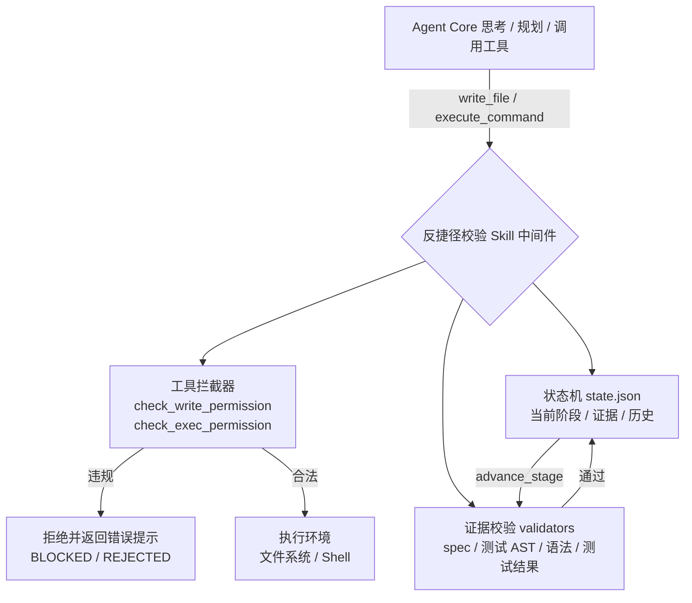

# 反捷径校验 Skill（Anti-Shortcut Validation Skill）

[](https://github.com/Xuqing0415/phase-barrier/actions/workflows/ci.yml)
[](https://pypi.org/project/phase-barrier/)
[](https://pypi.org/project/phase-barrier/)

强制编码 Agent（如 Alpha-SWE）遵循标准工程师 SOP 的**阶段门禁（Stage Gate）**组件：
以“阶段状态机 + 证据校验 + 工具拦截”的组合，阻止 Agent 跳步、偷步或伪造产出。

> 流程：**需求 → spec 设计 → 测试用例 → 实现 → 测试 → 修复 → 交付**

## 特性

- **不可绕过**：校验逻辑位于 Agent 工具调用层，Agent 无法通过自然语言指令绕过；状态文件由 Skill 独占原子写入。
- **最小侵入**：通过包装 `write_file` / `execute_command` 实现拦截，不改变核心工具接口。
- **证据明确**：每个阶段要求具体可验证的产物（文件、AST 统计、测试退出码与摘要）。
- **自动校验**：spec 章节检查、测试 AST 分析（函数数量 + 断言）、实现语法检查、测试结果解析，全部自动完成。
- **可配置**：YAML + Pydantic 配置，可自定义阶段要求、文件模式、测试命令，或关闭某些严格校验。
- **覆盖率门禁（v0.7.0）**：配置 `coverage_threshold` 后，测试阶段要求覆盖率报告存在且达标（pytest-cov / `go test -cover` / istanbul）。
- **K8s sidecar（v0.7.0）**：`deploy/k8s/` 模板 + `anti_shortcut.sidecar` HTTP 服务，Agent 容器不挂载门禁目录，无法绕过阶段门禁。
- **状态签名（v0.8.0）**：配置 `state_hmac_key`（或环境变量 `PHASE_BARRIER_HMAC_KEY`）后，state.json 写入 HMAC-SHA256 签名并在加载时校验，篡改即拒绝启动。
- **证据签名（v0.9.0）**：阶段推进时把证据文件 SHA-256 写入独立清单 `evidence_manifest.json`（可选 HMAC 签名），`verify-evidence` 可对照工作区检测事后篡改。
- **密钥轮换（v0.9.0）**：`state_hmac_keys` / `rotate-key` 支持无中断轮换 HMAC 密钥（宽限期双密钥，可从无签名状态启用签名）。
- **审计远程推送（v0.9.0）**：配置 `audit_remote_url` 后，审计事件异步批量转发到 SIEM / webhook，推送失败不影响门禁。

## 架构

```
Alpha-SWE Agent Core（思考 / 规划 / 调用工具）
        │  工具调用（write_file, execute_command, advance_stage）
        ▼
反捷径校验 Skill（中间件）
        ├── 状态机      ：阶段与证据持久化到 <workspace>/.agent_gate/state.json
        ├── 证据校验    ：每个阶段的校验函数（validators）
        └── 工具拦截    ：包装 write_file / execute_command，注入 advance_stage
        │  合法调用
        ▼
执行环境（文件系统 / Shell）
```

Mermaid 版本（GitHub 上渲染）：



## 快速开始

```bash
pip install phase-barrier        # 从 PyPI 安装（发行名与仓库同名）
# 或本地构建后安装：
#   python -m pip install --upgrade build
#   python -m build
#   pip install dist/phase_barrier-*.whl

pip install -e .            # 开发模式安装（依赖 pydantic / pyyaml / structlog）
python examples/minimal_agent.py   # 最小可运行的 Agent 接入示例（拦截 + 正常流程）
python examples/demo.py            # 完整演示（含违规尝试被拦截）
python -m pytest                   # 运行测试套件
```

### 集成到 Agent（Alpha-SWE 等基于工具调用的 Agent）

```python
from anti_shortcut import AntiShortcutSkill

# 1. 启动时创建 Skill（user_request 由系统传入，作为阶段 0 证据）
skill = AntiShortcutSkill(
    workspace=".",
    config="anti_shortcut_config.yaml",   # 可选
    user_request="实现一个计算斐波那契数列的函数",
)

# 2. 用包装后的工具替换 Agent 工具表中的原始工具，并注入 advance_stage
tools = skill.install(agent.tools)

# 3. Agent 后续只能调用 tools["write_file"] / tools["execute_command"] / tools["advance_stage"]
```

最小可运行示例见 [`examples/minimal_agent.py`](examples/minimal_agent.py)：一个模拟 Agent 循环
先尝试跳步（被拦截），再按 spec → 测试 → 实现 → 运行测试推进到交付，可直接 `python examples/minimal_agent.py` 运行。

### 一键接入 + 插件加载

```python
from anti_shortcut import bootstrap, register_integration

# 一步完成：创建 Skill -> 包装工具 -> 注入 advance_stage -> 加载插件
bootstrap(
    agent_tools=agent.tools,          # Agent 暴露的工具表
    workspace=".",
    user_request="实现一个计算斐波那契数列的函数",
    agent=agent,                      # 透传给集成插件
)

# 进程内注册集成插件（宿主启动时注册，插件负责把包装后的工具装回 Agent）
def my_installer(agent, skill):
    skill.install(agent.tools)

register_integration("alpha-swe-adapter", my_installer)
```

发布为独立包的插件可声明入口点组 `anti_shortcut.integrations`（`pyproject.toml`）：

```toml
[project.entry-points."anti_shortcut.integrations"]
alpha-swe = "alpha_swe_adapter:install"
```

`load_plugins(agent, skill)` 会自动发现并执行入口点插件。

### 命令行门禁检查（编排器 / 人工监督）

```bash
python -m anti_shortcut inspect --workspace .            # 查看当前阶段
python -m anti_shortcut inspect --workspace . --json     # JSON 输出（便于自动化）
python -m anti_shortcut advance --workspace . --to 2     # 推进阶段（校验证据）
python -m anti_shortcut verify-evidence --workspace .   # 对照工作区校验证据签名清单（v0.9.0）
python -m anti_shortcut rotate-key --workspace . --from <旧密钥> --to <新密钥>  # 轮换状态签名密钥（v0.9.0）
```

`advance` 与 Agent 内部的 `advance_stage` 走同一套证据校验：通过返回退出码 0，被拒绝返回 1 并打印原因。

## GitHub Action 门禁（CI 集成）

仓库根目录提供复合 Action（`action.yml`），可直接把 phase-barrier 作为 CI 阶段闸门：
Agent 产出的工作区未达到期望阶段时，CI 直接失败。

```yaml
# 示例：PR 时要求工作区至少完成“实现代码”（阶段 3）
- uses: Xuqing0415/phase-barrier@v0.8.0
  with:
    workspace: .          # 工作区路径（相对仓库根）
    expected_stage: 3     # 0-6；当前阶段 < 期望阶段则失败
    # config: gate.yaml   # 可选：phase-barrier YAML 配置（含 coverage_threshold 等）
```

| 输入 | 默认 | 说明 |
|------|------|------|
| `workspace` | `.` | 工作区路径（相对仓库根） |
| `config` | 空 | YAML 配置文件路径 |
| `mode` | `inspect` | `inspect` 检查当前阶段；`advance` 推进到 `--to` 指定阶段 |
| `expected_stage` | `6` | inspect 模式：当前阶段低于该值则失败 |
| `to` | 空 | advance 模式的目标阶段（必须等于当前阶段 + 1） |
| `user_request` | 空 | advance 首次初始化时记录的用户需求原文 |
| `version` | 空 | 安装的 phase-barrier 版本（留空取最新版） |
| `local` | `false` | 安装本地仓库代码而非 PyPI（CI 自测用） |

完整示例见 `examples/github-action/gate.yml`（通用）、`gate-go.yml`（Go）、
`gate-rust.yml`（Rust）；Go / Rust 示例额外安装 `setup-go` / `rust-toolchain`，
让 `advance` 模式能用真实 `gofmt` / `cargo check` 校验实现。本项目 CI 自带
`gate-action` 自测 job，验证“达到期望阶段通过 / 未达到失败”两条路径。

该 Action 已发布到 [GitHub Marketplace](https://github.com/marketplace/actions/phase-barrier-gate)：
每次打 `v*` tag 时 release 工作流自动创建 GitHub Release（附 CHANGELOG 摘要与发行包），
Action 随之自动上架，用户可直接在 Marketplace 搜索 **Phase-Barrier Gate** 使用。

## 阶段定义与证据要求


| 阶段 | 名称 | 必需证据 | 校验方式 |
|------|------|----------|----------|
| 0 | 需求接收 | 用户需求原文（系统传入） | 自动记录 |
| 1 | Spec 设计 | `spec.md`，含 `## 需求分析` / `## 设计方案` / `## 接口定义`，且足够详细 | 文件存在 + 章节匹配 + 最小长度 |
| 2 | 测试用例 | `test_*.py` 等，测试函数数量 ≥ 阈值，每个函数含断言 | 文件存在 + AST 解析 |
| 3 | 实现代码 | 非测试 `*.py` 源码 | 文件存在 + 语法编译检查 |
| 4 | 运行测试 | 测试命令执行记录（退出码 + 输出摘要） | 拦截器记录 `last_test_run` |
| 5 | 修复与回归 | 修复后的代码 + 重新运行的测试全部通过 | 测试通过且发生在最后一次代码修改之后 |
| 6 | 交付 | （可选）交付总结 | 达到阶段 6 即完成 |

特殊分支：阶段 4 推进时，若最近一次测试**全部通过**且代码未被后续修改，则**跳过阶段 5 直接进入交付**；否则进入阶段 5 修复。

## 工具拦截规则

| 工具 / 命令 | 拦截条件 | 提示 |
|-------------|----------|------|
| `write_file` 写实现代码 | 阶段 < 2（测试未完成） | 请先完成测试用例编写 |
| `write_file` 写测试文件 | 阶段 < 1（spec 未完成） | 请先完成 spec 设计 |
| `write_file` 写 `.agent_gate/` | 任意阶段 | 门禁目录由 Skill 独占 |
| `execute_command` 运行测试（pytest 等） | 阶段 < 3（实现未完成） | 请先完成实现代码 |
| shell 写入源码/测试（`>`、`sed -i`、`mv`、`rm`、`touch`…） | 同上按文件类型 | 与 `write_file` 相同的阶段限制 |
| 任何访问 `.agent_gate` 的命令 | 任意阶段 | 禁止通过 shell 访问门禁目录 |
| 只读命令（`ls` / `cat` / `dir` …） | 无 | 放行 |

`advance_stage(new_stage)` 是唯一合法的阶段推进入口：

- `new_stage` 必须等于当前阶段 + 1，否则返回“不允许跳跃阶段”；
- 推进前运行**当前阶段**的证据校验器，不通过则返回详细失败原因；
- 通过后写入状态机（原子写：临时文件 + `os.replace`），并记录证据哈希。

## 状态与审计

- 状态文件：`<workspace>/.agent_gate/state.json` —— 当前阶段、阶段历史、证据哈希、最近测试结果。
- 审计日志：`<workspace>/.agent_gate/audit.log` —— 结构化 JSON，记录阶段变更、拦截事件、校验结果。
- 证据签名清单：`<workspace>/.agent_gate/evidence_manifest.json` —— 每次阶段推进时记录的证据文件 SHA-256（可选 HMAC 签名），供交付 / CI 用 `verify-evidence` 事后比对（v0.9.0）。
- 审计远程推送：配置 `audit_remote_url` 后，每条审计事件异步 POST 到 SIEM / webhook（单事件为对象，多事件为 JSON 数组），队列有界、失败只计数（v0.9.0）。

示例状态：

```json
{
  "version": 1,
  "current_stage": 2,
  "completed_stages": [0, 1],
  "stage_history": [
    { "stage": 0, "name": "需求接收", "timestamp": "...", "evidence": {"user_request": "..."} },
    { "stage": 1, "name": "Spec 设计", "timestamp": "...", "evidence": {"spec": {"sha256": "..."}} }
  ],
  "evidence": { "user_request": "...", "spec": {}, "tests": {}, "implementation": {}, "last_test_run": {} }
}
```

## 配置

参考 [`examples/anti_shortcut_config.yaml`](examples/anti_shortcut_config.yaml)（缺省使用内置默认值）：

```yaml
min_test_functions: 2              # 测试函数数量阈值
spec_sections: ["## 需求分析", "## 设计方案", "## 接口定义"]
test_file_patterns: ["test_*.py", "tests/**/test_*.py"]
test_commands: ['^\\s*pytest\\b', '^\\s*npm\\s+test\\b', ...]
protect_gate_dir: true             # 生产环境配合只读卷挂载
allow_other_files_any_stage: true  # 其他文件类型（README 等）是否不限阶段
state_hmac_key: ""                 # 可选：状态签名 HMAC 密钥（或用环境变量 PHASE_BARRIER_HMAC_KEY）
state_hmac_keys: []                # v0.9.0：轮换期接受的旧密钥列表（或用环境变量 PHASE_BARRIER_HMAC_KEYS）
evidence_signing: true             # v0.9.0：是否把证据文件哈希写入签名清单
audit_remote_url: ""               # v0.9.0：可选，审计事件异步推送到 SIEM / webhook
audit_remote_token: ""             # v0.9.0：可选，推送时携带的 Bearer Token
```

### 覆盖率门禁（v0.7.0）

配置 `coverage_threshold` 后，阶段 4（运行测试）与阶段 5（修复回归）推进时，
要求测试输出包含覆盖率报告且不低于阈值，防止“测试全过但几乎没测到代码”：

```yaml
coverage_threshold: 80          # 0-100 百分比；不配置则不做覆盖率要求
```

运行测试命令需带覆盖率报告（phase-barrier 自动提取，无需额外配置）：

- Python：`pytest --cov --cov-report=term-missing`（解析 `TOTAL` 行）
- Go：`go test -cover ./...`（解析 `coverage: N% of statements`）
- JavaScript：`npm test -- --coverage` 或 `npx vitest --coverage`（解析 istanbul `All files` 行）

覆盖率报告缺失或低于阈值时，`advance_stage` 返回明确拒绝原因（如
“覆盖率不足：60.0% < 80.0%”），Agent 需补跑带覆盖率的测试后才能推进。

## 安全与防绕过

- **状态文件保护**：Agent 可用的工具全部被包装；`.agent_gate` 的任何写入 / shell 访问都被拦截。
- **生产部署**：将 `.agent_gate` 以只读卷挂载给 Agent 执行容器（`-v /host/path:/.agent_gate:ro`），实现进程级隔离——即使 Agent 绕过工具包装也无法篡改状态。
- **空壳防护**：测试文件经 AST 分析，要求测试函数数量 ≥ 阈值且每个函数含断言（`assert` / `pytest.raises`）。
- **伪造防护**：证据文件在推进时记录 SHA-256；阶段 5 要求测试运行发生在最后一次代码修改之后。
- **状态签名（v0.8.0）**：配置 HMAC 密钥后，状态文件每次写入都带 `signature` 字段并在加载时校验；篡改 / 未签名 / 密钥不匹配 → `TamperedStateError`，CLI 明确报错并拒绝运行。
- **证据签名（v0.9.0）**：独立于 state.json 的证据清单记录每个阶段推进时的文件 SHA-256；即使 Agent 伪造状态文件，`verify-evidence` 仍能发现证据被替换 / 缺失。
- **密钥轮换（v0.9.0）**：`rotate-key` 校验现有签名后以新密钥重新签名；`state_hmac_keys` / `PHASE_BARRIER_HMAC_KEYS` 提供宽限期双密钥，轮换不中断。
- **审计远程推送（v0.9.0）**：`audit_remote_url` 把审计事件异步转发到 SIEM；队列有界、失败只计数，不影响门禁执行。
- **日志审计**：所有拦截与阶段变更写入 JSON 审计日志，便于事后分析“哪些请求被拦截”“跳过步骤的频率”。

## Docker 只读卷部署（进程级防绕过）

即使 Agent 绕过工具包装直接操作文件系统，也可通过“只读挂载”从文件系统层面锁死 `.agent_gate`：

```bash
docker compose -f deploy/docker-compose.yml up --build
```

- `gate-keeper` 服务：对 `/workspace/.agent_gate` **可写**，负责初始化状态并跑完整门禁流程；
- `agent` 服务：`/workspace` 可写（产出代码），但 `/workspace/.agent_gate` **只读挂载**（`:ro`）；
- `agent` 侧探针验证：读状态正常、写门禁目录被拒绝（`PermissionError`）、写工作区源码正常。

详见 [`deploy/README.md`](deploy/README.md)。
Kubernetes 版（v0.7.0）见 [`deploy/k8s/README.md`](deploy/k8s/README.md)：
Job `gate-keeper` 初始化门禁状态卷，`agent + gate-sidecar` 共享工作区卷，
sidecar 独占挂载门禁目录并暴露 HTTP API（`anti_shortcut.sidecar`），
Agent 只能通过 sidecar 查询 / 推进阶段。

## 模块结构

```
anti_shortcut/
├── __init__.py        # 公共 API
├── config.py          # GateConfig（Pydantic）+ YAML 加载
├── state.py           # StateManager：JSON 原子持久化、阶段历史、证据
├── validators.py      # 各阶段证据校验器（spec / tests / implementation / test_run / retest）
├── interceptors.py    # 命令分类、门禁目录检测、shell 写路径提取、测试输出摘要
├── audit.py           # 结构化 JSON 审计日志（structlog，按文件独立实例）
├── remote_audit.py    # v0.9.0：审计事件异步批量推送到 SIEM / webhook（零依赖）
├── evidence.py        # v0.9.0：证据文件哈希 + HMAC 签名清单（verify-evidence）
├── skill.py           # AntiShortcutSkill：工具包装 + advance_stage + 权限检查
├── integration.py     # 集成层：bootstrap / 插件注册 / 入口点发现
├── paths.py           # 路径工具：glob 匹配 / 文件遍历 / SHA-256
├── languages/         # 语言适配层（v0.3.0）
│   ├── base.py        #   LanguageAdapter 抽象基类 + 共享校验策略
│   ├── python.py      #   PythonAdapter（AST + compile）
│   ├── javascript.py  #   JavaScriptAdapter（node --check / tsc --noEmit + jest --listTests）
│   ├── java.py        #   JavaAdapter（javac + JUnit 启发式）
│   ├── go.py          #   GoAdapter（gofmt + go test 解析）
│   ├── rust.py        #   RustAdapter（cargo check / rustc + cargo test 解析）
│   └── __init__.py    #   注册表 / detect_language / get_adapter / 入口点加载
├── __main__.py        # CLI：python -m anti_shortcut inspect / advance
├── sidecar.py         # K8s sidecar HTTP 门禁服务（v0.7.0）
examples/
├── demo.py                        # 模拟 Agent 完整演示（含违规拦截）
├── minimal_agent.py               # 最小可运行 Agent 接入示例
├── anti_shortcut_config.yaml      # Python 项目示例配置
└── anti_shortcut_js_config.yaml   # JavaScript / TypeScript 项目示例配置
deploy/
├── Dockerfile                     # 打包镜像（含 CLI）
├── docker-compose.yml             # gate-keeper（可写）+ agent（.agent_gate 只读）
├── seed_gate.py                   # gate-keeper：初始化并跑完整门禁流程
├── probe.py                       # agent 探针：验证只读挂载生效
├── k8s/                           # Kubernetes 部署模板（v0.7.0）
│   ├── pvc.yaml                   #   workspace / gate 两个 PVC
│   ├── gate-keeper.yaml           #   初始化门禁状态的 Job
│   ├── gate-sidecar.yaml          #   agent + sidecar Deployment + Service
│   └── README.md                  #   kind / minikube 验证步骤
└── README.md                      # 部署说明
tests/                             # pytest 测试套件（234 个用例）
```

## 设计取舍

- **阶段 4 → 6 跳过修复**：测试一次通过时不必强制走修复阶段（见第 7 章工作流）。
- **修复后强制回归**：阶段 5 校验最近一次测试必须“通过”且“晚于最后一次代码修改”，防止改完不重测。
- **启发式 shell 解析**：`sed -i`、重定向等写路径提取是尽力而为；核心强制边界是工具包装 + 只读挂载，shell 解析用于纵深防御。
- **测试质量**：本 Skill 防“跳步”，不负责“测试写得好不好”；覆盖率与人工抽查可作为补充（见第 10 章）。

## 环境说明

- 实现语言：Python 3.10+（已在 3.14 验证）
- 依赖：`pydantic>=2`、`PyYAML>=6`、`structlog>=23`（可选 `pytest` 用于测试）
- 跨平台：Windows / Linux / macOS（门禁目录权限建议在 Linux 容器 + 只读卷场景使用）

## 多语言支持（v0.3.0 语言适配层）

v0.3.0 起，语言相关逻辑（文件识别、语法检查、测试统计、测试命令识别）抽象为
**语言适配器（Language Adapter）**。核心包内置 Python、JavaScript/TypeScript、Java、Go 与 Rust
适配器，第三方可注册自定义适配器；未显式指定时按工作区标志文件自动检测。

### 快速启用

```python
from anti_shortcut import AntiShortcutSkill

# 显式指定语言（优先级最高），无需再手工配文件模式
skill = AntiShortcutSkill(
    workspace=".",
    config={"language": "javascript"},
    user_request="实现一个计算斐波那契数列的函数",
)
```

```yaml
# 或 YAML（完整示例见 examples/anti_shortcut_js_config.yaml）
language: javascript
min_test_functions: 2
test_commands:
  - '^\s*npm\s+test\b'
  - '^\s*npx\s+(jest|vitest|mocha|playwright)\b'
  - '^\s*npx\s+tsc\s+--noEmit\b'
```

不写 `language` 时自动检测标志文件：`package.json` → `javascript`，`pom.xml` → `java`，
`go.mod` → `go`，`Cargo.toml` → `rust`，`requirements.txt` / `setup.py` / `pyproject.toml` → `python`；
未识别时默认 Python。适配器默认文件模式与 YAML 中的 `test_file_patterns` / `source_file_patterns`
自动合并（配置只增不减）。项目配置示例：`examples/anti_shortcut_js_config.yaml`、
`anti_shortcut_go_config.yaml`、`anti_shortcut_rust_config.yaml`。

### 内置适配器

| 适配器 | 文件识别 | 语法检查 | 测试校验 |
|--------|----------|----------|----------|
| `PythonAdapter` | `test_*.py` / `tests/**` 为测试，`*.py` 为实现 | `compile()` | AST 解析：测试函数数 + `assert` / `pytest.raises` |
| `JavaScriptAdapter` | `*.test.js` / `*.spec.ts` / `__tests__/` 为测试，`src/**` 与 `*.js|ts|jsx|tsx` 为实现 | `node --check` / `tsc --noEmit`（优先 `tsconfig.json` 项目检查；工具缺失返回明确错误） | 项目安装 acorn 时真实解析（`test` / `it` / `describe` 声明 + `expect` / `assert` 断言），否则启发式；可选 `jest --listTests --json` 动态发现；输出解析：Jest / Vitest（`Tests: N passed`）与 Playwright（`N passed` / `N failed`） |
| `JavaAdapter` | `*Test.java` / `*Tests.java` / `src/test/**` 为测试，`src/**` 与 `*.java` 为实现 | 项目级 `mvn test-compile` / `gradle compileTestJava`（优先 `mvnw` / `gradlew`，带缓存）；无构建工具时回退 `javac -proc:none` | 启发式：`@Test` 注解数 + JUnit/Hamcrest 断言关键字 |
| `GoAdapter` | `*_test.go` 为测试，`*.go` / `cmd|internal|pkg/**` 为实现 | `gofmt -e`（Go 工具链缺失返回明确错误） | 启发式：`func TestXxx(t *testing.T)` 函数数 + `t.Error` / `t.Fatal` / `assert` / `require` 断言 |
| `RustAdapter` | `tests/**` / `*_test.rs` / `src/**/tests.rs` 为测试，`src/**` 与 `*.rs` 为实现 | `cargo check`（有 `Cargo.toml`）/ `rustc` 单文件回退（工具缺失返回明确错误） | 启发式：`#[test]` / `#[tokio::test]` 属性数 + `assert!` / `assert_eq!` / `assert_ne!` |

### 自定义适配器

只需 4 步即可接入一种新语言（10 分钟内可完成最小实现）：

**1. 实现 `LanguageAdapter`**（文件识别用默认模式即可，至少实现 `check_syntax`）：

```python
# my_adapters.py
from anti_shortcut.languages import LanguageAdapter

class MyLanguageAdapter(LanguageAdapter):
    name = "mylang"
    source_file_patterns = ["*.foo"]        # 实现文件模式
    test_file_patterns = ["*.test.foo"]     # 测试文件模式
    test_command_patterns = [r"^\s*foo\s+test\b"]  # 测试命令正则

    def check_syntax(self, path):
        return True, "ok"   # 返回 (是否通过, 错误信息)

    def analyze_tests(self, path):
        # 返回 {"test_functions": [...], "assertions_total": N}
        # 可参考 anti_shortcut/languages/javascript.py 的启发式实现
        ...
```

**2. 本地配置加载**（无需打包，直接指定导入路径）：

```yaml
language_adapter: "my_adapters.MyLanguageAdapter"
adapter_options:
  min_test_functions: 3    # 传给适配器的额外参数（由适配器自行解释）
```

**3. 打包发布为独立包**（便于复用与分享）：

```toml
[project]
name = "phase-barrier-mylang-adapter"
version = "0.1.0"
dependencies = ["phase-barrier>=0.3.0"]

[project.entry-points."phase_barrier.languages"]
mylang = "my_adapters:MyLanguageAdapter"
```

```bash
python -m build && twine check dist/* && twine upload dist/*
```

**4. 入口点注册后按名称引用**（安装插件包即可，无需再写导入路径）：

```yaml
language: mylang
```

**可运行示例**：`examples/custom_adapter/` 提供了一个虚构 `.foo` 语言的完整插件
（`foo_language.py` + `foo_config.yaml` + `pyproject.toml`），运行
`python examples/custom_adapter/demo.py` 可看到自定义适配器参与
文件识别、语法检查、测试校验与测试命令识别的完整拦截流程。

适配器选择优先级：显式 `language` > 自定义 `language_adapter` > 自动检测 > 默认 Python。

## 常见问题（FAQ）

**如何自定义阶段或证据要求？**
通过 YAML 配置覆盖即可，无需改代码：

```yaml
spec_file: design.md
spec_sections: ["## 需求", "## 方案", "## 接口"]
spec_min_chars: 80
min_test_functions: 3
```

把配置路径传给 `AntiShortcutSkill(..., config="my_gate.yaml")` 或 CLI 的 `--config`。

**如何关闭某道门禁？**
每个校验器都有开关或阈值可调，例如：

- 不强制实现代码：`require_implementation: false`
- 允许任意阶段写“其他”文件：`allow_other_files_any_stage: true`（默认已开启）
- 调低 spec 长度门槛：`spec_min_chars: 0`
- 关闭门禁目录 shell 保护（不推荐）：`protect_gate_dir: false`

彻底“一键关闭全部门禁”与设计目标相悖，不支持。

**如何适配非 Python 项目？**
v0.3.0 起推荐使用语言适配层：`language: javascript` / `java` / `go` / `rust`（内置 Python、
JavaScript/TypeScript、Java、Go、Rust 适配器，并支持按工作区标志文件自动检测）；更特殊的语言可提供自定义 `LanguageAdapter`
（用 `language_adapter` 配置导入路径）。不引入适配器时，仍可直接配置
`test_file_patterns` / `source_file_patterns` / `test_commands` 三项，
门禁逻辑（阶段状态机 + 证据校验 + 工具拦截）保持不变。

**Agent 被拦截后如何继续？**
拦截只返回错误提示，不破坏任何状态。Agent 补齐当前阶段证据（如写完 `spec.md`）后重新调用
`advance_stage` 即可；也可以由编排器用 CLI `python -m anti_shortcut advance --workspace . --to N` 人工复核后推进。

## Roadmap（规划）

- **v0.6.0 已完成**：JavaScript 真实解析（acorn / `jest --listTests --json`）、Java 项目级编译（`mvn test-compile` / `gradle compileTestJava`，`mvnw` / `gradlew` 优先 + 指纹缓存）、Go / Rust GitHub Action 门禁示例与项目配置模板。
- **v0.7.0 已完成**：JS 输出解析覆盖 Vitest / Playwright、覆盖率门禁 `coverage_threshold`（pytest-cov / `go test -cover` / istanbul 表）、K8s sidecar 部署模板与 HTTP 门禁服务（`anti_shortcut.sidecar`）。
- **v0.8.0 已完成**：Java 输出解析增强（Surefire `Skipped` / Gradle / JUnit Console）、状态签名 HMAC（`state_hmac_key` / `PHASE_BARRIER_HMAC_KEY`）、GitHub Action 市场发布（tag 即 Release）。
- **v0.9.0 已完成**：审计日志远程推送（SIEM：`audit_remote_url` + 异步批量 + 队列保护）、证据签名（`evidence_manifest.json` + `verify-evidence`）、HMAC 密钥轮换（`state_hmac_keys` / `rotate-key`，含无签名→启用签名迁移）。
- **v0.10.0（规划）**：审计远程推送增强（TLS 自定义 CA / 重试退避）、证据清单导出与 sigstore 签名、更多语言适配器输出解析。
- **插件机制增强**：通过入口点注册自定义校验器与拦截规则（当前已有语言适配器入口点 `phase_barrier.languages` 与集成插件入口点 `anti_shortcut.integrations`）。
- **供应链**：接入 sigstore 签名与 trusted publishing，提升包可信度。

版本按 tag 驱动发布（`git tag vX.Y.Z && git push origin vX.Y.Z`），每次发版更新 CHANGELOG。

## 反馈与贡献

- 使用中遇到问题或想提需求：请在 [GitHub Issues](https://github.com/Xuqing0415/phase-barrier/issues) 反馈，最好附上复现步骤（版本、配置、命令输出）。
- 关注 PyPI 下载量与版本更新：[phase-barrier · PyPI](https://pypi.org/project/phase-barrier/)。
- 欢迎贡献代码：提交前请运行 `python -m pytest`，并遵循 Conventional Commits 提交规范（`feat:` / `fix:` / `docs:` / `test:`）。

## 构建与发布（PyPI）

构建并检查发行包：

```bash
python -m pip install --upgrade build twine
python -m build          # 生成 dist/*.tar.gz 与 dist/*.whl
twine check dist/*       # 校验元数据与 README 渲染
```

发布（需在 PyPI 注册账号，并配置 `~/.pypirc` 或 `TWINE_*` 环境变量）：

```bash
twine upload dist/*      # 正式发布到 PyPI
# twine upload --repository testpypi dist/*   # 先发 TestPyPI 验证
```

- 版本号由 git tag 驱动（`setuptools-scm`）：打 `vX.Y.Z` tag 后构建即为 `X.Y.Z`，无需再手工同步 `pyproject.toml` 与 `__init__.py`。发布流程：`git tag v0.1.1 && git push --tags`。
- CI（`.github/workflows/ci.yml`）：push / PR 时在 Python 3.10–3.14 矩阵上运行 `pytest` + `examples/demo.py`；`package` job 构建 sdist/wheel 并执行 `twine check` 后上传为 artifact。
- 自动发布（`.github/workflows/release.yml`）：打 `v*` tag 时自动构建并发布到 PyPI，使用仓库 Secret `PYPI_API_TOKEN`。
- 发行名说明：本项目发行名为 `phase-barrier`（与仓库同名），import 包名仍为 `anti_shortcut`，CLI 命令仍为 `anti-shortcut`。
