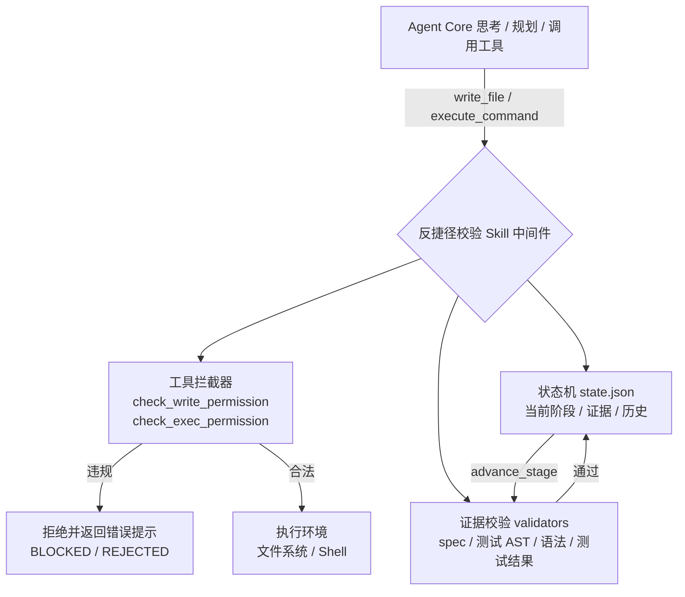

# 反捷径校验 Skill（Anti-Shortcut Validation Skill）

[](https://github.com/Xuqing0415/phase-barrier/actions/workflows/ci.yml)
[](https://pypi.org/project/phase-barrier/)
[](https://pypi.org/project/phase-barrier/)
[](https://github.com/marketplace/actions/phase-barrier-gate)

强制编码 Agent（如 Alpha-SWE）遵循标准工程师 SOP 的**阶段门禁（Stage Gate）**组件：
以“阶段状态机 + 证据校验 + 工具拦截”的组合，阻止 Agent 跳步、偷步或伪造产出。

> 流程：**需求 → spec 设计 → 测试用例 → 实现 → 测试 → 修复 → 交付**

## 特性

- **不可绕过**：校验逻辑位于 Agent 工具调用层，Agent 无法通过自然语言指令绕过；状态文件由 Skill 独占原子写入。
- **最小侵入**：通过包装 `write_file` / `execute_command` 实现拦截，不改变核心工具接口。
- **证据明确**：每个阶段要求具体可验证的产物（文件、AST 统计、测试退出码与摘要）。
- **自动校验**：spec 章节检查、测试 AST 分析（函数数量 + 断言）、实现语法检查、测试结果解析，全部自动完成。
- **可配置**：YAML + Pydantic 配置，可自定义阶段要求、文件模式、测试命令，或关闭某些严格校验。
- **覆盖率门禁（v0.7.0）**：配置 `coverage_threshold` 后，测试阶段要求覆盖率报告存在且达标（pytest-cov / `go test -cover` / istanbul）。
- **K8s sidecar（v0.7.0）**：`deploy/k8s/` 模板 + `anti_shortcut.sidecar` HTTP 服务，Agent 容器不挂载门禁目录，无法绕过阶段门禁。
- **状态签名（v0.8.0）**：配置 `state_hmac_key`（或环境变量 `PHASE_BARRIER_HMAC_KEY`）后，state.json 写入 HMAC-SHA256 签名并在加载时校验，篡改即拒绝启动。
- **证据签名（v0.9.0）**：阶段推进时把证据文件 SHA-256 写入独立清单 `evidence_manifest.json`（可选 HMAC 签名），`verify-evidence` 可对照工作区检测事后篡改。
- **密钥轮换（v0.9.0）**：`state_hmac_keys` / `rotate-key` 支持无中断轮换 HMAC 密钥（宽限期双密钥，可从无签名状态启用签名）。
- **审计远程推送（v0.9.0）**：配置 `audit_remote_url` 后，审计事件异步批量转发到 SIEM / webhook，推送失败不影响门禁。
- **审计远程推送增强（v0.10.0）**：`audit_remote_ca_bundle` 支持自建 SIEM 的 TLS 自定义 CA；`audit_remote_retries` + 指数退避自动重试瞬时失败。
- **证据清单导出（v0.10.0）**：`export-evidence` 把证据清单 + 文件哈希导出为可审计 bundle，供外部核对。
- **供应链签名（v0.10.0）**：发布流程用 sigstore（GitHub OIDC 身份）对 sdist / wheel 签名，可 `cosign verify-blob` 校验来源。
- **语言输出解析（v0.10.0）**：`summarize_test_output` 接入语言适配器，Go / Rust 测试输出生成专属摘要（含失败用例名）。
- **自定义校验器与拦截规则（v0.12.0）**：`phase_barrier.validators` / `phase_barrier.interceptors` 入口点 + 
  进程内注册（`register_validator` / `register_rule`），可覆盖内置阶段校验或追加自定义拦截规则。
- **审计 mTLS 端到端示例（v0.12.0）**：`examples/mtls_audit/` 提供自签 CA + 服务端 / 客户端证书生成、
  收集端点与一键演示，验证 `audit_remote_client_cert` / `audit_remote_client_key` 双向 TLS 链路。
- **边界防护补强（v0.13.0）**：拦截器覆盖命令注入变体、`&>` / `&>>` / `>|` 重定向、`dd of=` / 引号包裹等门禁目录写路径；CLI 对损坏状态、越界阶段号、证据缺失 / 语法错误给出明确报错；插件可运行示例 `examples/plugin_rules/`。
- **脚本写入检测（v0.14.0）**：`extract_written_paths` 识别 `python -c` / `node -e` / `bash -c` 等脚本参数内的 `open(...)` / `Path(...).write_text` / `fs.writeFileSync` / 重定向写入路径，脚本改代码同样受阶段门禁约束；`verify-evidence` / `export-evidence` 的损坏清单 / 缺字段 / 非法参数均有明确报错；GitHub Action 增加输入校验。
- **审计故障告警（v0.15.0）**：`RemoteAuditSink` 新增 `on_failure` 回调与 `metrics()`；`AntiShortcutSkill` 自动把 `audit_remote_failed` 告警写入本地 `audit.log`（本地专用 logger，避免自喂循环）；sidecar `/api/advance` / `/api/test-run` / `/api/source-change` 增加输入校验（bool / 越界阶段号、`output` 类型、`.agent_gate` 路径）。
- **CI 真实工具链与覆盖率门禁（v0.16.0）**：CI 矩阵安装 Node.js / Go / Rust / Ruby，激活 JS/Go/Rust/Ruby 适配器真实工具测试；输出解析支持 ANSI 颜色码与 istanbul 千分位；`coverage_threshold` 增加 0-100 校验；CI 新增 `coverage run -m pytest` + `--fail-under=90` 覆盖率门禁（当前核心包 90%）。

- **透明代理（v0.17.0）**：sidecar 新增 `POST /api/write` / `POST /api/exec`，把门禁下沉到文件系统层——路径限定工作区内、拒绝 `.agent_gate`、按阶段拦截写入与测试命令，执行后自动记录测试摘要；新增 Agent 侧 `GateClient`（仅标准库 urllib）与 `examples/k8s_proxy/` 最小示例。

- **CLI 门禁命令与 Action exec 模式（v0.18.0）**：`python -m anti_shortcut write --path ... --content/--stdin` 与 `exec --command ... [--timeout]` 把透明代理下沉到命令行——写文件 / 执行命令先过阶段门禁，测试命令自动记录结果，被拦截退出码 2；GitHub Action 新增 `mode: exec` 与 `command` 输入，可在 CI 里经门禁执行测试并驱动阶段推进。

- **代理审计事件与 exec 工作目录（v0.19.0）**：透明代理新增 5 类审计事件（`proxy_write_ok` / `proxy_write_denied` / `proxy_exec_ok` / `proxy_exec_denied` / `proxy_exec_timeout`），每次写入 / 执行 / 拦截均记录阶段摘要并推送到本地 `audit.log` 与远端 SIEM；CLI `exec`、sidecar `/api/exec` 与 `GateClient` 三端新增 `cwd` 参数，支持在工作区子目录内执行命令。

- **sidecar 审计查询与统一 CLI（v0.20.0）**：`GET /api/audit` 按时间倒序读取本地审计日志，支持 `limit`（1-500）与 `event` 过滤，配合 v0.19.0 的 5 类代理审计事件可远程核对拦截行为；`GateClient.audit()` 客户端方法；新增 `python -m anti_shortcut sidecar` 统一 CLI 入口（等价 `python -m anti_shortcut.sidecar`），K8s 清单切换为新入口。

- **审计查询增强与 sidecar mTLS（v0.21.0）**：`GET /api/audit` 新增 `offset` 分页与 `since` / `until` 时间范围过滤（响应含 `total` / `offset` 元信息）；新增 `GET /api/verify-evidence` 远程校验证据清单与 `GateClient.verify_evidence()`；sidecar 支持入站 mTLS 访问控制（`--tls-cert` / `--tls-key` / `--tls-client-ca`，`GateClient` 新增 `cert` / `ca` 参数），示例 `examples/mtls_sidecar/`。
- **编排器钩子 SDK（v0.22.0）**：新增 `PhaseBarrier` 轻量 SDK，供 Alpha-SWE 等平台在任务启动 / 阶段切换钩子调用（`check` / `advance` / `record_test_run` / `verify_evidence`），返回结构稳定、JSON 可序列化；CLI 新增 `python -m anti_shortcut check --stage N`；集成示例 `examples/orchestrator_hooks/`。
- **Java 输出解析增强 + Action 元数据（v0.23.0）**：Java 适配器失败用例提取（Surefire `<<< FAILURE!` / Gradle `> FAILED` / JUnit Console `MethodSource`，去重上限 50）与 Gradle `skipped` 统计；GitHub Action 新增 `mode: check`（只读校验是否放行进入 `--stage` 阶段）与 `mode: exec` 的 `cwd` 工作目录输入，CI 自测覆盖 check 放行 / 拒绝 / 缺参路径。
- **Java 输出解析剩余项（v0.24.0）**：Surefire 参数化用例（displayName 含逗号 / `[N]` 序号）与 `<<< ERROR!`
  超时 / 异常细分；Gradle `> SKIPPED`、`BUILD SUCCESSFUL` 汇总与多模块 reactor 聚合；JUnit Platform Console
  `MethodSource` 嵌套格式（`Class.method(ParameterizedTest)`）；测试命令识别补充 Windows wrapper
  （`mvnw.cmd test` / `gradlew.bat test` / `.\mvnw`）。
- **配置脚手架与配置指南（v0.26.0）**：`python -m anti_shortcut init` 自动检测语言并生成带注释的 YAML 模板
  （可选 `--with-coverage` / `--hmac-key` / `--audit-url` / `--rules`）；新增全字段配置指南 `docs/configuration.md`。
- **Docker 一键体验（v0.26.0）**：`docker/demo/` 提供模拟 Agent 演示镜像（拦截跳步 + 规范流程全通），
  无需本地安装即可 `docker run --rm -it ghcr.io/xuqing0415/phase-barrier-demo` 体验。
- **C++ / .NET 适配器（v0.26.0）**：`CppAdapter`（g++/clang++ `-fsyntax-only`、GoogleTest 宏统计、
  `ctest` / GoogleTest 输出解析）与 `DotNetAdapter`（复用 C# 项目级 `dotnet build` 与 VSTest 输出解析）；
  自动检测 `CMakeLists.txt` / `Makefile` / `*.vcxproj`。
- **PR 增量校验（v0.26.0）**：`verify-evidence --git-base <ref>` 输出 `git_impact` 变更影响映射
  （spec / test / source / other）；GitHub Action 新增 `mode: verify` 与 `git_base` 输入，示例 `examples/github-action/gate-pr.yml`。
- **内置安全规则包（v0.26.0）**：`no_shell_injection` / `no_path_traversal` / `no_hardcoded_secrets` /
  `require_license_header` 开箱即用，YAML `rules:` 一键启用，写入内容参与规则校验。
- **K8s Helm 一键部署（v0.27.0）**：新增 `deploy/helm/phase-barrier/` Helm chart，sidecar + agent 双容器、PVC / emptyDir 存储、mTLS / HMAC / 审计推送（ConfigMap + Secret）、gate-keeper 一次性 Job；`helm install` 一行部署，kind 端到端测试 `deploy/k8s/kind-e2e-test.sh` 纳入 CI。
- **Agent 框架集成示例（v0.27.0）**：LangChain `Tool` 包装（`examples/langchain_integration/`）、AutoGPT 命令包装（`examples/autogpt_integration/`）、SWE-agent 工具脚本（`examples/swe_agent_integration/`），汇总见 `docs/integrations.md`，示例不依赖第三方框架包即可运行。
- **性能基准与回归门禁（v0.27.0）**：`benchmarks/bench.py` 压测多 Agent 并发状态写入（文件锁 + 原子写 + HMAC）与 sidecar HTTP 写文件 / 执行命令的延迟与吞吐，CI 以 `--fail-fast` 门禁防止性能大幅退化。


## 架构

```
Alpha-SWE Agent Core（思考 / 规划 / 调用工具）
        │  工具调用（write_file, execute_command, advance_stage）
        ▼
反捷径校验 Skill（中间件）
        ├── 状态机      ：阶段与证据持久化到 <workspace>/.agent_gate/state.json
        ├── 证据校验    ：每个阶段的校验函数（validators）
        └── 工具拦截    ：包装 write_file / execute_command，注入 advance_stage
        │  合法调用
        ▼
执行环境（文件系统 / Shell）
```

Mermaid 版本（GitHub 上渲染）：



- **多 Agent 并发共享门禁状态（v0.26.3）**：`StateManager` 跨进程文件锁（POSIX `flock` / Windows `msvcrt`）
  + 写前重载 + 唯一临时文件原子替换，多 Agent / 多进程并发推进不丢更新、状态文件不损坏；
  `PhaseBarrier.refresh()` 重载状态与证据清单，编排器轮询即可读取其他 Agent 的推进结果。
## 快速开始

```bash
pip install phase-barrier        # 从 PyPI 安装（发行名与仓库同名）
# 或本地构建后安装：
#   python -m pip install --upgrade build
#   python -m build
#   pip install dist/phase_barrier-*.whl

pip install -e .            # 开发模式安装（依赖 pydantic / pyyaml / structlog）
python examples/minimal_agent.py   # 最小可运行的 Agent 接入示例（拦截 + 正常流程）
python examples/demo.py            # 完整演示（含违规尝试被拦截）
python -m pytest                   # 运行测试套件
```

**一键生成配置（v0.26.0）**：在项目根目录执行 `python -m anti_shortcut init`，
自动检测语言并生成带注释的 `config.yaml`（可选 `--with-coverage` / `--hmac-key` /
`--audit-url` / `--rules`，完整字段见 [配置指南](docs/configuration.md)）：

```bash
python -m anti_shortcut init --with-coverage --rules no_path_traversal,no_shell_injection
```

**Docker 一键体验（v0.26.0）**：无需本地安装任何依赖，直接运行模拟 Agent 的
“跳步被拦截 + 规范流程全通”演示：

```bash
docker run --rm -it ghcr.io/xuqing0415/phase-barrier-demo
```

### 集成到 Agent（Alpha-SWE 等基于工具调用的 Agent）

```python
from anti_shortcut import AntiShortcutSkill

# 1. 启动时创建 Skill（user_request 由系统传入，作为阶段 0 证据）
skill = AntiShortcutSkill(
    workspace=".",
    config="anti_shortcut_config.yaml",   # 可选
    user_request="实现一个计算斐波那契数列的函数",
)

# 2. 用包装后的工具替换 Agent 工具表中的原始工具，并注入 advance_stage
tools = skill.install(agent.tools)

# 3. Agent 后续只能调用 tools["write_file"] / tools["execute_command"] / tools["advance_stage"]
```

最小可运行示例见 [`examples/minimal_agent.py`](examples/minimal_agent.py)：一个模拟 Agent 循环
先尝试跳步（被拦截），再按 spec → 测试 → 实现 → 运行测试推进到交付，可直接 `python examples/minimal_agent.py` 运行。

### 一键接入 + 插件加载

```python
from anti_shortcut import bootstrap, register_integration

# 一步完成：创建 Skill -> 包装工具 -> 注入 advance_stage -> 加载插件
bootstrap(
    agent_tools=agent.tools,          # Agent 暴露的工具表
    workspace=".",
    user_request="实现一个计算斐波那契数列的函数",
    agent=agent,                      # 透传给集成插件
)

# 进程内注册集成插件（宿主启动时注册，插件负责把包装后的工具装回 Agent）
def my_installer(agent, skill):
    skill.install(agent.tools)

register_integration("alpha-swe-adapter", my_installer)
```

发布为独立包的插件可声明入口点组 `anti_shortcut.integrations`（`pyproject.toml`）：

```toml
[project.entry-points."anti_shortcut.integrations"]
alpha-swe = "alpha_swe_adapter:install"
```

`load_plugins(agent, skill)` 会自动发现并执行入口点插件。

### 命令行门禁检查（编排器 / 人工监督）

```bash
python -m anti_shortcut init [--language python] [--output config.yaml]  # 生成带注释的配置模板（v0.26.0）
python -m anti_shortcut inspect --workspace .            # 查看当前阶段
python -m anti_shortcut inspect --workspace . --json     # JSON 输出（便于自动化）
python -m anti_shortcut check --workspace . --stage 2 --json  # 钩子校验：是否放行进入阶段 2（v0.22.0）
python -m anti_shortcut advance --workspace . --to 2     # 推进阶段（校验证据）
python -m anti_shortcut verify-evidence --workspace .   # 对照工作区校验证据签名清单（v0.9.0）
python -m anti_shortcut verify-evidence --workspace . --git-base origin/main  # Git 门禁：证据文件不可事后篡改（v0.11.0）；--json 输出 git_impact 变更影响映射（v0.26.0）
python -m anti_shortcut rotate-key --workspace . --from <旧密钥> --to <新密钥>  # 轮换状态签名密钥（v0.9.0）
python -m anti_shortcut export-evidence --workspace . --out bundle.json   # 导出证据清单为可审计 bundle（v0.10.0）
```

`advance` 与 Agent 内部的 `advance_stage` 走同一套证据校验：通过返回退出码 0，被拒绝返回 1 并打印原因。

## GitHub Action 门禁（CI 集成）

仓库根目录提供复合 Action（`action.yml`），可直接把 phase-barrier 作为 CI 阶段闸门：
Agent 产出的工作区未达到期望阶段时，CI 直接失败。

```yaml
# 示例：PR 时要求工作区至少完成“实现代码”（阶段 3）
- uses: Xuqing0415/phase-barrier@v0.26.0
  with:
    workspace: .          # 工作区路径（相对仓库根）
    expected_stage: 3     # 0-6；当前阶段 < 期望阶段则失败
    # config: gate.yaml   # 可选：phase-barrier YAML 配置（含 coverage_threshold 等）
```

| 输入 | 默认 | 说明 |
|------|------|------|
| `workspace` | `.` | 工作区路径（相对仓库根） |
| `config` | 空 | YAML 配置文件路径 |
| `mode` | `inspect` | `inspect` 检查阶段；`advance` 推进到 `--to`；`exec` 经门禁执行 `command`，`check` 只读校验是否放行（v0.22.0）；`verify` 校验本次 PR 变更未篡改证据文件（v0.26.0） |
| `expected_stage` | `6` | inspect 模式：当前阶段低于该值则失败 |
| `to` | 空 | advance 模式的目标阶段（必须等于当前阶段 + 1） |
| `command` | 空 | exec 模式的测试/校验命令（仅 mode=exec 必填，v0.18.0） |
| `stage` | 空 | check 模式的阶段号 0-6，校验是否放行进入该阶段（v0.22.0） |
| `cwd` | 空 | exec 模式的工作目录（相对 workspace，可选；v0.19.0） |
| `git_base` | PR 基线 SHA | verify 模式的 Git 基线 ref，默认 `${{ github.event.pull_request.base.sha }}`（v0.26.0） |
| `user_request` | 空 | advance 首次初始化时记录的用户需求原文 |
| `version` | 空 | 安装的 phase-barrier 版本（留空取最新版） |
| `local` | `false` | 安装本地仓库代码而非 PyPI（CI 自测用） |

**参数联动（v0.25.0）**：`mode` 决定需要哪些参数——`advance` 需配 `to`，`check` 需配 `stage`，`exec` 需配 `command`；不满足时门禁直接失败并输出 `::error::`。

**Action 输出（v0.25.0）**：门禁步骤通过后会输出 `workspace` / `stage` / `allowed`，下游步骤可通过 `steps.gate.outputs.*` 复用：

```yaml
- uses: Xuqing0415/phase-barrier@v0.26.0
  id: gate
  with:
    workspace: .
    expected_stage: 3

- name: 复用门禁输出
  run: |
    echo "当前阶段: ${{ steps.gate.outputs.stage }}"
    echo "是否放行: ${{ steps.gate.outputs.allowed }}"
```

`stage` 取值：`inspect` = 当前阶段，`check` = 输入 `stage`，`advance` = 目标 `to`，`exec` 模式为空。


**输入校验（v0.14.0 / v0.18.0 / v0.23.0 / v0.26.0）**：`mode` 必须是 `inspect` / `advance` / `exec` / `check` / `verify`；`expected_stage` 与 `advance` 模式的 `to` 与 `check` 模式的 `stage` 必须是 0-6 的整数；`workspace` 必须存在。参数非法时 CI 直接失败并输出 `::error::` 定位信息，避免静默误判。

完整示例见 `examples/github-action/gate.yml`（通用）、`gate-go.yml`（Go）、
`gate-rust.yml`（Rust）、`gate-pr.yml`（PR 增量校验，v0.26.0）；Go / Rust 示例额外安装 `setup-go` / `rust-toolchain`，
让 `advance` 模式能用真实 `gofmt` / `cargo check` 校验实现。本项目 CI 自带
`gate-action` 自测 job，验证“达到期望阶段通过 / 未达到失败”两条路径。

该 Action 已发布到 [GitHub Marketplace](https://github.com/marketplace/actions/phase-barrier-gate)
（已确认上架：Marketplace 页面显示 **Phase-Barrier Gate**，Latest 版本与 GitHub Release 同步）：
每次打 `v*` tag 时 release 工作流自动创建 GitHub Release（附 CHANGELOG 摘要与发行包），
Action 随之自动上架，用户可直接在 Marketplace 搜索 **Phase-Barrier Gate** 使用。 上架与发布流程详见 `docs/publish-to-marketplace.md`。

## 编排器集成（Orchestrator Hooks，v0.22.0）

Alpha-SWE 等 Agent 平台可以“轻量 SDK”方式在 **任务启动 / 阶段切换** 钩子接入阶段门禁：
校验逻辑留在本包，编排器只做调用，返回结构稳定、JSON 可序列化。

```python
from anti_shortcut import PhaseBarrier

barrier = PhaseBarrier(workspace=project_dir, user_request=user_request)

# 任务启动钩子：Agent 声称从阶段 1（spec 设计）开始
gate = barrier.check(1)
if not gate["allowed"]:
    prompt = gate["message"]   # 回传给 Agent，强制补全前置证据

# 阶段切换钩子：Agent 声称完成阶段 1，申请进入阶段 2
result = barrier.advance(2)
if not result["success"]:
    prompt = result["error"]
```

- `check(stage)`：只读校验，返回 `{allowed, stage, stage_name, current_stage, message, violations}`。
- `advance(to_stage)`：与 `advance_stage` 同一套证据校验，返回 `{success, stage, stage_name, message/error, evidence}`。
- `record_test_run({exit_code, output})`：登记测试运行结果（阶段 4 推进校验依赖）。
- `verify_evidence()`：返回 `{ok, violations, signed}`，清单缺失 / 签名不匹配统一 `ok=False`。
- `list_stages()`：阶段清单，返回 `[{stage, name, entry, evidence}]`（v0.26.2）。
- `stage_of(path)`：把文件路径归类到对应阶段证据（spec→1 / test→2 / source→3 / other→None），
  与 `verify-evidence --git-base` 的 `git_impact` 分类一致（v0.26.2）。

CLI 等价调用：`python -m anti_shortcut check --workspace . --stage 2 --json`。
完整示例见 `examples/orchestrator_hooks/`。

## CLI 透明代理命令（v0.18.0）

v0.17.0 的透明代理除了 HTTP sidecar，也提供命令行形态，供编排器 / CI / 人工复核使用：

```bash
# 经门禁写入工作区文件（路径须解析在工作区内；--content 与 --stdin 二选一）
python -m anti_shortcut write --workspace . --path spec.md --content "..."
cat notes.md | python -m anti_shortcut write --workspace . --path notes.md --stdin

# 经门禁执行 shell 命令（测试命令自动记录结果；--timeout 1-3600 秒；--cwd 子目录）
python -m anti_shortcut exec --workspace . --command "pytest -q" --json

# 在工作区子目录执行（--cwd 须解析在工作区内；默认工作区根）
python -m anti_shortcut exec --workspace . --cwd sub --command "go test ./..." --json

# 以 sidecar 模式启动门禁 HTTP 服务（阻塞，Ctrl+C 退出；K8s 可作为容器入口）
python -m anti_shortcut sidecar --workspace . --host 0.0.0.0 --port 8080

# 以 mTLS 保护 sidecar API（客户端证书由 --tls-client-ca 指定 CA 验证，v0.21.0）
python -m anti_shortcut sidecar --workspace . --tls-cert server.crt --tls-key server.key --tls-client-ca ca.pem
```

退出码语义：`write` / `exec` 被阶段门禁拒绝时返回 **2**；参数或环境错误返回 **1**；
`exec` 放行后返回命令自身的退出码（0 = 成功）。`--json` 输出结构化结果
（`write` 返回 `{ok, path, kind}`；`exec` 返回 `{ok, exit_code, output, recorded_test_run}`）。

## 阶段定义与证据要求


| 阶段 | 名称 | 必需证据 | 校验方式 |
|------|------|----------|----------|
| 0 | 需求接收 | 用户需求原文（系统传入） | 自动记录 |
| 1 | Spec 设计 | `spec.md`，含 `## 需求分析` / `## 设计方案` / `## 接口定义`，且足够详细 | 文件存在 + 章节匹配 + 最小长度 |
| 2 | 测试用例 | `test_*.py` 等，测试函数数量 ≥ 阈值，每个函数含断言 | 文件存在 + AST 解析 |
| 3 | 实现代码 | 非测试 `*.py` 源码 | 文件存在 + 语法编译检查 |
| 4 | 运行测试 | 测试命令执行记录（退出码 + 输出摘要） | 拦截器记录 `last_test_run` |
| 5 | 修复与回归 | 修复后的代码 + 重新运行的测试全部通过 | 测试通过且发生在最后一次代码修改之后 |
| 6 | 交付 | （可选）交付总结 | 达到阶段 6 即完成 |

特殊分支：阶段 4 推进时，若最近一次测试**全部通过**且代码未被后续修改，则**跳过阶段 5 直接进入交付**；否则进入阶段 5 修复。

## 工具拦截规则

| 工具 / 命令 | 拦截条件 | 提示 |
|-------------|----------|------|
| `write_file` 写实现代码 | 阶段 < 2（测试未完成） | 请先完成测试用例编写 |
| `write_file` 写测试文件 | 阶段 < 1（spec 未完成） | 请先完成 spec 设计 |
| `write_file` 写 `.agent_gate/` | 任意阶段 | 门禁目录由 Skill 独占 |
| `execute_command` 运行测试（pytest 等） | 阶段 < 3（实现未完成） | 请先完成实现代码 |
| shell 写入源码/测试（`>`、`sed -i`、`mv`、`rm`、`touch`…） | 同上按文件类型 | 与 `write_file` 相同的阶段限制 |
| 任何访问 `.agent_gate` 的命令 | 任意阶段 | 禁止通过 shell 访问门禁目录 |
| 只读命令（`ls` / `cat` / `dir` …） | 无 | 放行 |

`advance_stage(new_stage)` 是唯一合法的阶段推进入口：

- `new_stage` 必须等于当前阶段 + 1，否则返回“不允许跳跃阶段”；
- 推进前运行**当前阶段**的证据校验器，不通过则返回详细失败原因；
- 通过后写入状态机（原子写：临时文件 + `os.replace`），并记录证据哈希。

### 自定义校验器与拦截规则（v0.12.0）

阶段校验器与工具拦截规则都支持扩展，优先级：自定义（进程内 + 入口点）> 内置：

- **自定义校验器**：`register_validator(stage, fn)` 进程内注册，或通过 `phase_barrier.validators` 入口点组加载
  （`{stage: fn}` 映射 / 带 `stage` 属性的单校验器 / 返回映射的工厂三种形式），覆盖对应阶段的证据校验；
  校验器签名 `fn(workspace, config, state, adapter=None) -> (ok, message, evidence)`。
- **自定义拦截规则**：`register_rule(name, rule)` 进程内注册，或通过 `phase_barrier.interceptors` 入口点组加载
  （规则函数 / 返回规则列表的工厂 / `{name: rule}` 映射 / 带 `rules` 属性对象四种形式）；
  规则签名 `rule(kind, target, config, stage) -> (False, reason) 拦截 / (True, reason) 放行 / None 弃权`，
  在 `write` / `exec` 内置检查之前评估，首个决定性结论生效（异常规则自动跳过）。

第三方包在 `pyproject.toml` 声明入口点即可参与门禁：

```toml
[project.entry-points."phase_barrier.validators"]
strict_tests = "my_plugins:strict_tests_validator"

[project.entry-points."phase_barrier.interceptors"]
deny_vendor = "my_plugins:deny_vendor_rule"
```

**可运行示例**：`examples/plugin_rules/` 提供完整插件包（自定义校验器 + 拦截规则 +
`pyproject.toml` 入口点声明 + demo）：

```bash
python examples/plugin_rules/demo.py                    # 进程内注册（零安装）
pip install -e examples/plugin_rules                    # 安装示例插件包
python examples/plugin_rules/demo.py --via-entry-point  # 经入口点加载
```

校验器函数声明所属阶段后即可被入口点识别：

```python
def require_design_review(workspace, config, state, adapter=None):
    if not (workspace / "design-review.md").exists():
        return False, "缺少 design-review.md", {}
    return True, "design-review 已提供", {}

require_design_review.stage = 1   # 注册到阶段 1，覆盖内置 spec 校验
```

## 状态与审计

- 状态文件：`<workspace>/.agent_gate/state.json` —— 当前阶段、阶段历史、证据哈希、最近测试结果。
- 审计日志：`<workspace>/.agent_gate/audit.log` —— 结构化 JSON，记录阶段变更、拦截事件、校验结果。
- 证据签名清单：`<workspace>/.agent_gate/evidence_manifest.json` —— 每次阶段推进时记录的证据文件 SHA-256（可选 HMAC 签名），供交付 / CI 用 `verify-evidence` 事后比对（v0.9.0）。
- 审计远程推送：配置 `audit_remote_url` 后，每条审计事件异步 POST 到 SIEM / webhook（单事件为对象，多事件为 JSON 数组），队列有界、失败只计数（v0.9.0）。
- 证据清单导出：`export-evidence` 生成包含清单、当前文件哈希与校验结果的 JSON bundle，可发给第三方审计（v0.10.0）。

示例状态：

```json
{
  "version": 1,
  "current_stage": 2,
  "completed_stages": [0, 1],
  "stage_history": [
    { "stage": 0, "name": "需求接收", "timestamp": "...", "evidence": {"user_request": "..."} },
    { "stage": 1, "name": "Spec 设计", "timestamp": "...", "evidence": {"spec": {"sha256": "..."}} }
  ],
  "evidence": { "user_request": "...", "spec": {}, "tests": {}, "implementation": {}, "last_test_run": {} }
}
```

## 配置

参考 [`examples/anti_shortcut_config.yaml`](examples/anti_shortcut_config.yaml)（缺省使用内置默认值）：

```yaml
min_test_functions: 2              # 测试函数数量阈值
spec_sections: ["## 需求分析", "## 设计方案", "## 接口定义"]
test_file_patterns: ["test_*.py", "tests/**/test_*.py"]
test_commands: ['^\\s*pytest\\b', '^\\s*npm\\s+test\\b', ...]
protect_gate_dir: true             # 生产环境配合只读卷挂载
allow_other_files_any_stage: true  # 其他文件类型（README 等）是否不限阶段
state_hmac_key: ""                 # 可选：状态签名 HMAC 密钥（或用环境变量 PHASE_BARRIER_HMAC_KEY）
state_hmac_keys: []                # v0.9.0：轮换期接受的旧密钥列表（或用环境变量 PHASE_BARRIER_HMAC_KEYS）
evidence_signing: true             # v0.9.0：是否把证据文件哈希写入签名清单
audit_remote_url: ""               # v0.9.0：可选，审计事件异步推送到 SIEM / webhook
audit_remote_retries: 2            # v0.10.0：发送失败重试次数（指数退避）
audit_remote_backoff_factor: 0.5    # v0.10.0：退避基数秒（0.5→1→2…）
audit_remote_ca_bundle: ""          # v0.10.0：可选，自建 SIEM TLS 的自定义 CA（PEM 路径）
audit_remote_client_cert: ""       # v0.11.0：可选，mTLS 客户端证书（PEM 路径，与 client_key 成对）
audit_remote_client_key: ""        # v0.11.0：可选，mTLS 客户端私钥（PEM 路径）
audit_remote_headers: {}           # v0.11.0：可选，自定义请求头（如 {X-Tenant: acme}）
audit_remote_spool_dir: ""         # v0.11.0：可选，失败事件持久化重试队列目录
audit_remote_token: ""             # v0.9.0：可选，推送时携带的 Bearer Token
```

### 覆盖率门禁（v0.7.0）

配置 `coverage_threshold` 后，阶段 4（运行测试）与阶段 5（修复回归）推进时，
要求测试输出包含覆盖率报告且不低于阈值，防止“测试全过但几乎没测到代码”：

```yaml
coverage_threshold: 80          # 0-100 百分比；不配置则不做覆盖率要求
```

运行测试命令需带覆盖率报告（phase-barrier 自动提取，无需额外配置）：

- Python：`pytest --cov --cov-report=term-missing`（解析 `TOTAL` 行）
- Go：`go test -cover ./...`（解析 `coverage: N% of statements`）
- JavaScript：`npm test -- --coverage` 或 `npx vitest --coverage`（解析 istanbul `All files` 行）

覆盖率报告缺失或低于阈值时，`advance_stage` 返回明确拒绝原因（如
“覆盖率不足：60.0% < 80.0%”），Agent 需补跑带覆盖率的测试后才能推进。

## 安全与防绕过

- **状态文件保护**：Agent 可用的工具全部被包装；`.agent_gate` 的任何写入 / shell 访问都被拦截。
- **生产部署**：将 `.agent_gate` 以只读卷挂载给 Agent 执行容器（`-v /host/path:/.agent_gate:ro`），实现进程级隔离——即使 Agent 绕过工具包装也无法篡改状态。
- **空壳防护**：测试文件经 AST 分析，要求测试函数数量 ≥ 阈值且每个函数含断言（`assert` / `pytest.raises`）。
- **伪造防护**：证据文件在推进时记录 SHA-256；阶段 5 要求测试运行发生在最后一次代码修改之后。
- **状态签名（v0.8.0）**：配置 HMAC 密钥后，状态文件每次写入都带 `signature` 字段并在加载时校验；篡改 / 未签名 / 密钥不匹配 → `TamperedStateError`，CLI 明确报错并拒绝运行。
- **证据签名（v0.9.0）**：独立于 state.json 的证据清单记录每个阶段推进时的文件 SHA-256；即使 Agent 伪造状态文件，`verify-evidence` 仍能发现证据被替换 / 缺失。
- **密钥轮换（v0.9.0）**：`rotate-key` 校验现有签名后以新密钥重新签名；`state_hmac_keys` / `PHASE_BARRIER_HMAC_KEYS` 提供宽限期双密钥，轮换不中断。
- **审计远程推送（v0.9.0）**：`audit_remote_url` 把审计事件异步转发到 SIEM；队列有界、失败只计数，不影响门禁执行。
- **审计可靠性（v0.10.0）**：发送失败按指数退避自动重试；自定义 CA 支持内网 / 自建 SIEM 的 HTTPS 端点。
- **审计传输安全（v0.11.0）**：mTLS 客户端证书（`audit_remote_client_cert` / `audit_remote_client_key`）
  支持双向 TLS；`audit_remote_headers` 携带自定义请求头；`audit_remote_spool_dir` 把重试耗尽的事件
  落盘为 JSONL，进程重启自动恢复重发（适合 K8s 滚动重启 / 崩溃场景）。
- **证据 Git 门禁（v0.11.0）**：`verify-evidence --git-base <ref>` 用 `git diff --name-only` 列出本次
  变更文件，与证据清单条目求交集——证据文件被本次提交修改即失败，供 CI 强制“证据不可事后篡改”。
- **日志审计**：所有拦截与阶段变更写入 JSON 审计日志，便于事后分析“哪些请求被拦截”“跳过步骤的频率”。

## Docker 只读卷部署（进程级防绕过）

即使 Agent 绕过工具包装直接操作文件系统，也可通过“只读挂载”从文件系统层面锁死 `.agent_gate`：

```bash
docker compose -f deploy/docker-compose.yml up --build
```

- `gate-keeper` 服务：对 `/workspace/.agent_gate` **可写**，负责初始化状态并跑完整门禁流程；
- `agent` 服务：`/workspace` 可写（产出代码），但 `/workspace/.agent_gate` **只读挂载**（`:ro`）；
- `agent` 侧探针验证：读状态正常、写门禁目录被拒绝（`PermissionError`）、写工作区源码正常。

详见 [`deploy/README.md`](deploy/README.md)。
Kubernetes 版（v0.7.0）见 [`deploy/k8s/README.md`](deploy/k8s/README.md)：
Job `gate-keeper` 初始化门禁状态卷，`agent + gate-sidecar` 共享工作区卷，
sidecar 独占挂载门禁目录并暴露 HTTP API（`anti_shortcut.sidecar`），
Agent 只能通过 sidecar 查询 / 推进阶段。 v0.17.0 起可把文件写入与命令执行也交给 sidecar（`POST /api/write`、`POST /api/exec`），门禁下沉到文件系统层。

## 模块结构

```
anti_shortcut/
├── __init__.py        # 公共 API
├── config.py          # GateConfig（Pydantic）+ YAML 加载
├── state.py           # StateManager：JSON 原子持久化、阶段历史、证据
├── validators.py      # 各阶段证据校验器（spec / tests / implementation / test_run / retest）
├── interceptors.py    # 命令分类、门禁目录检测、shell 写路径提取、测试输出摘要
├── audit.py           # 结构化 JSON 审计日志（structlog，按文件独立实例）
├── remote_audit.py    # v0.9.0：审计事件异步批量推送到 SIEM / webhook（零依赖）
├── evidence.py        # v0.9.0：证据文件哈希 + HMAC 签名清单（verify-evidence）
├── skill.py           # AntiShortcutSkill：工具包装 + advance_stage + 权限检查
├── integration.py     # 集成层：bootstrap / 插件注册 / 入口点发现
├── paths.py           # 路径工具：glob 匹配 / 文件遍历 / SHA-256
├── languages/         # 语言适配层（v0.3.0）
│   ├── base.py        #   LanguageAdapter 抽象基类 + 共享校验策略
│   ├── python.py      #   PythonAdapter（AST + compile）
│   ├── javascript.py  #   JavaScriptAdapter（node --check / tsc --noEmit + jest --listTests）
│   ├── java.py        #   JavaAdapter（javac + JUnit 启发式）
│   ├── go.py          #   GoAdapter（gofmt + go test 解析）
│   ├── rust.py        #   RustAdapter（cargo check / rustc + cargo test 解析）
│   ├── ruby.py        #   RubyAdapter（ruby -c + RSpec / Minitest 解析，v0.11.0）
│   ├── csharp.py      #   CSharpAdapter（dotnet build + xUnit / NUnit / MSTest 解析，v0.11.0）
│   └── __init__.py    #   注册表 / detect_language / get_adapter / 入口点加载
├── __main__.py        # CLI：inspect / advance / write / exec / verify-evidence ...
├── sidecar.py         # K8s sidecar HTTP 门禁服务（v0.7.0）
├── proxy.py           # 透明代理引擎：write/exec 门禁（v0.17.0）
├── proxy_client.py    # Agent 侧 GateClient（v0.17.0）
examples/
├── demo.py                        # 模拟 Agent 完整演示（含违规拦截）
├── minimal_agent.py               # 最小可运行 Agent 接入示例
├── anti_shortcut_config.yaml      # Python 项目示例配置
├── anti_shortcut_js_config.yaml   # JavaScript / TypeScript 项目示例配置
├── anti_shortcut_go_config.yaml   # Go 项目示例配置
├── anti_shortcut_rust_config.yaml # Rust 项目示例配置
├── custom_adapter/                # 自定义语言适配器插件示例（虚构 .foo 语言）
├── github-action/                 # GitHub Action 门禁示例（gate.yml / gate-go.yml / gate-rust.yml / evidence-gate.yml）
├── mtls_audit/                    # v0.12.0：审计 mTLS 端到端示例（证书生成 + 收集端点 + demo）
└── plugin_rules/                # v0.13.0：自定义校验器 / 拦截规则插件示例（进程内注册 + 入口点加载）
deploy/
├── Dockerfile                     # 打包镜像（含 CLI）
├── docker-compose.yml             # gate-keeper（可写）+ agent（.agent_gate 只读）
├── seed_gate.py                   # gate-keeper：初始化并跑完整门禁流程
├── probe.py                       # agent 探针：验证只读挂载生效
├── k8s/                           # Kubernetes 部署模板（v0.7.0）
│   ├── pvc.yaml                   #   workspace / gate 两个 PVC
│   ├── gate-keeper.yaml           #   初始化门禁状态的 Job
│   ├── gate-sidecar.yaml          #   agent + sidecar Deployment + Service
│   └── README.md                  #   kind / minikube 验证步骤
└── README.md                      # 部署说明
tests/                             # pytest 测试套件（337 个用例）
```

## 设计取舍

- **阶段 4 → 6 跳过修复**：测试一次通过时不必强制走修复阶段（见第 7 章工作流）。
- **修复后强制回归**：阶段 5 校验最近一次测试必须“通过”且“晚于最后一次代码修改”，防止改完不重测。
- **启发式 shell 解析**：`sed -i`、重定向等写路径提取是尽力而为；核心强制边界是工具包装 + 只读挂载，shell 解析用于纵深防御。
- **测试质量**：本 Skill 防“跳步”，不负责“测试写得好不好”；覆盖率与人工抽查可作为补充（见第 10 章）。

## 环境说明

- 实现语言：Python 3.10+（已在 3.14 验证）
- 依赖：`pydantic>=2`、`PyYAML>=6`、`structlog>=23`（可选 `pytest` 用于测试）
- 跨平台：Windows / Linux / macOS（门禁目录权限建议在 Linux 容器 + 只读卷场景使用）

## 多语言支持（v0.3.0 语言适配层）

v0.3.0 起，语言相关逻辑（文件识别、语法检查、测试统计、测试命令识别）抽象为
**语言适配器（Language Adapter）**。核心包内置 Python、JavaScript/TypeScript、Java、Go、Rust、Ruby、
C#、C++ 与 .NET 适配器，第三方可注册自定义适配器；未显式指定时按工作区标志文件自动检测。

### 快速启用

```python
from anti_shortcut import AntiShortcutSkill

# 显式指定语言（优先级最高），无需再手工配文件模式
skill = AntiShortcutSkill(
    workspace=".",
    config={"language": "javascript"},
    user_request="实现一个计算斐波那契数列的函数",
)
```

```yaml
# 或 YAML（完整示例见 examples/anti_shortcut_js_config.yaml）
language: javascript
min_test_functions: 2
test_commands:
  - '^\s*npm\s+test\b'
  - '^\s*npx\s+(jest|vitest|mocha|playwright)\b'
  - '^\s*npx\s+tsc\s+--noEmit\b'
```

不写 `language` 时自动检测标志文件：`package.json` → `javascript`，`pom.xml` → `java`，
`go.mod` → `go`，`Cargo.toml` → `rust`，`Gemfile` / `*.gemspec` → `ruby`，
`*.csproj` / `*.sln` → `csharp`，`CMakeLists.txt` / `Makefile` / `*.vcxproj` → `cpp`，`composer.json` → `php`，
`requirements.txt` / `setup.py` / `pyproject.toml` → `python`；未识别时默认 Python。
.NET 项目可显式 `language: dotnet` 启用 `DotNetAdapter`（与 `csharp` 共用实现，便于按生态区分）。
适配器默认文件模式与 YAML 中的 `test_file_patterns` / `source_file_patterns`
自动合并（配置只增不减）。完整字段说明见 [配置指南](docs/configuration.md)。
项目配置示例：`examples/anti_shortcut_js_config.yaml`、`anti_shortcut_go_config.yaml`、
`anti_shortcut_rust_config.yaml`。

### 内置适配器

| 适配器 | 文件识别 | 语法检查 | 测试校验 |
|--------|----------|----------|----------|
| `PythonAdapter` | `test_*.py` / `tests/**` 为测试，`*.py` 为实现 | `compile()` | AST 解析：测试函数数 + `assert` / `pytest.raises` / `unittest.TestCase` 的 `self.assert*` 断言 |
| `JavaScriptAdapter` | `*.test.js` / `*.spec.ts` / `__tests__/` 为测试，`src/**` 与 `*.js|ts|jsx|tsx` 为实现 | `node --check` / `tsc --noEmit`（优先 `tsconfig.json` 项目检查；工具缺失返回明确错误） | 项目安装 acorn 时真实解析（`test` / `it` / `describe` 声明 + `expect` / `assert` 断言），否则启发式；可选 `jest --listTests --json` 动态发现；输出解析：Jest / Vitest（`Tests: N passed`）、Playwright（`N passed` / `N failed`）与 Cypress（`All specs passed!` / `N passing` / `N failing`） |
| `JavaAdapter` | `*Test.java` / `*Tests.java` / `src/test/**` 为测试，`src/**` 与 `*.java` 为实现 | 项目级 `mvn test-compile` / `gradle compileTestJava`（优先 `mvnw` / `gradlew`，带缓存）；无构建工具时回退 `javac -proc:none` | 启发式：`@Test` 注解数（JUnit / TestNG）+ JUnit/Hamcrest 断言关键字；输出解析：Surefire / Gradle / JUnit Console / TestNG（`Total tests run:`） |
| `GoAdapter` | `*_test.go` 为测试，`*.go` / `cmd|internal|pkg/**` 为实现 | `gofmt -e`（Go 工具链缺失返回明确错误） | 启发式：`func TestXxx(t *testing.T)` 函数数 + `t.Error` / `t.Fatal` / `assert` / `require` 断言 |
| `RustAdapter` | `tests/**` / `*_test.rs` / `src/**/tests.rs` 为测试，`src/**` 与 `*.rs` 为实现 | `cargo check`（有 `Cargo.toml`）/ `rustc` 单文件回退（工具缺失返回明确错误） | 启发式：`#[test]` / `#[tokio::test]` 属性数 + `assert!` / `assert_eq!` / `assert_ne!` |
| `CSharpAdapter` | `*Test.cs` / `*Tests.cs` / `**/Tests/**` 为测试，`*.cs` 为实现 | 项目级 `dotnet build`（查找 `.csproj` / `.sln` 项目根，带指纹缓存；无项目根或工具缺失返回明确错误） | 启发式：`[Fact]` / `[Theory]` / `[Test]` 特性数 + `Assert.*` 断言；输出解析：VSTest `Passed! - Failed: F, Passed: P` / NUnit |
| `CppAdapter` | `test_*.cpp` / `*_test.cpp` / `tests/**` 为测试，`*.cpp` / `*.cc` / `*.cxx` / `*.c` / `*.h` / `*.hpp` 为实现 | C++：`g++ -fsyntax-only`（`clang++` 回退）；C：`gcc -fsyntax-only`（`clang` / `cc` 回退）；编译器缺失返回明确错误 | 启发式：GoogleTest `TEST(` / `TEST_F(` 与 Catch2 `TEST_CASE(` / `SCENARIO(` 宏数 + `EXPECT_*` / `ASSERT_*` / `REQUIRE*` / `CHECK*` 断言；输出解析：`[  PASSED  ]` / `[  FAILED  ]` / ctest / Catch2（`All tests passed` / `FAILED:`） |
| `DotNetAdapter` | 同 `CSharpAdapter`（`name="dotnet"`） | 同 `CSharpAdapter` | 同 `CSharpAdapter`（显式 `language: dotnet` 启用） |
| `PhpAdapter` | `*Test.php` / `tests/**` / `spec/**` 为测试，`*.php` / `src/**` / `app/**` 为实现 | `php -l`（PHP CLI 缺失返回明确错误） | 启发式：PHPUnit `public function testXxx` 方法 + `#[Test]` 属性数 + `assert*()` / `expectException()` 断言；输出解析：`OK (N tests, M assertions)` / `Tests: N, Failures: M, Errors: K` / `FAILURES!` |

### 自定义适配器

只需 4 步即可接入一种新语言（10 分钟内可完成最小实现）：

**1. 实现 `LanguageAdapter`**（文件识别用默认模式即可，至少实现 `check_syntax`）：

```python
# my_adapters.py
from anti_shortcut.languages import LanguageAdapter

class MyLanguageAdapter(LanguageAdapter):
    name = "mylang"
    source_file_patterns = ["*.foo"]        # 实现文件模式
    test_file_patterns = ["*.test.foo"]     # 测试文件模式
    test_command_patterns = [r"^\s*foo\s+test\b"]  # 测试命令正则

    def check_syntax(self, path):
        return True, "ok"   # 返回 (是否通过, 错误信息)

    def analyze_tests(self, path):
        # 返回 {"test_functions": [...], "assertions_total": N}
        # 可参考 anti_shortcut/languages/javascript.py 的启发式实现
        ...
```

**2. 本地配置加载**（无需打包，直接指定导入路径）：

```yaml
language_adapter: "my_adapters.MyLanguageAdapter"
adapter_options:
  min_test_functions: 3    # 传给适配器的额外参数（由适配器自行解释）
```

**3. 打包发布为独立包**（便于复用与分享）：

```toml
[project]
name = "phase-barrier-mylang-adapter"
version = "0.1.0"
dependencies = ["phase-barrier>=0.3.0"]

[project.entry-points."phase_barrier.languages"]
mylang = "my_adapters:MyLanguageAdapter"
```

```bash
python -m build && twine check dist/* && twine upload dist/*
```

**4. 入口点注册后按名称引用**（安装插件包即可，无需再写导入路径）：

```yaml
language: mylang
```

**可运行示例**：`examples/custom_adapter/` 提供了一个虚构 `.foo` 语言的完整插件
（`foo_language.py` + `foo_config.yaml` + `pyproject.toml`），运行
`python examples/custom_adapter/demo.py` 可看到自定义适配器参与
文件识别、语法检查、测试校验与测试命令识别的完整拦截流程。

适配器选择优先级：显式 `language` > 自定义 `language_adapter` > 自动检测 > 默认 Python。

## 常见问题（FAQ）

**如何自定义阶段或证据要求？**
通过 YAML 配置覆盖即可，无需改代码：

```yaml
spec_file: design.md
spec_sections: ["## 需求", "## 方案", "## 接口"]
spec_min_chars: 80
min_test_functions: 3
```

把配置路径传给 `AntiShortcutSkill(..., config="my_gate.yaml")` 或 CLI 的 `--config`。

**如何关闭某道门禁？**
每个校验器都有开关或阈值可调，例如：

- 不强制实现代码：`require_implementation: false`
- 允许任意阶段写“其他”文件：`allow_other_files_any_stage: true`（默认已开启）
- 调低 spec 长度门槛：`spec_min_chars: 0`
- 关闭门禁目录 shell 保护（不推荐）：`protect_gate_dir: false`

彻底“一键关闭全部门禁”与设计目标相悖，不支持。

**如何适配非 Python 项目？**
v0.3.0 起推荐使用语言适配层：`language: javascript` / `java` / `go` / `rust`（内置 Python、
JavaScript/TypeScript、Java、Go、Rust 适配器，并支持按工作区标志文件自动检测）；更特殊的语言可提供自定义 `LanguageAdapter`
（用 `language_adapter` 配置导入路径）。不引入适配器时，仍可直接配置
`test_file_patterns` / `source_file_patterns` / `test_commands` 三项，
门禁逻辑（阶段状态机 + 证据校验 + 工具拦截）保持不变。

**Agent 被拦截后如何继续？**
拦截只返回错误提示，不破坏任何状态。Agent 补齐当前阶段证据（如写完 `spec.md`）后重新调用
`advance_stage` 即可；也可以由编排器用 CLI `python -m anti_shortcut advance --workspace . --to N` 人工复核后推进。

## Roadmap（规划）

- **v0.6.0 已完成**：JavaScript 真实解析（acorn / `jest --listTests --json`）、Java 项目级编译（`mvn test-compile` / `gradle compileTestJava`，`mvnw` / `gradlew` 优先 + 指纹缓存）、Go / Rust GitHub Action 门禁示例与项目配置模板。
- **v0.7.0 已完成**：JS 输出解析覆盖 Vitest / Playwright、覆盖率门禁 `coverage_threshold`（pytest-cov / `go test -cover` / istanbul 表）、K8s sidecar 部署模板与 HTTP 门禁服务（`anti_shortcut.sidecar`）。
- **v0.8.0 已完成**：Java 输出解析增强（Surefire `Skipped` / Gradle / JUnit Console）、状态签名 HMAC（`state_hmac_key` / `PHASE_BARRIER_HMAC_KEY`）、GitHub Action 市场发布（tag 即 Release）。
- **v0.9.0 已完成**：审计日志远程推送（SIEM：`audit_remote_url` + 异步批量 + 队列保护）、证据签名（`evidence_manifest.json` + `verify-evidence`）、HMAC 密钥轮换（`state_hmac_keys` / `rotate-key`，含无签名→启用签名迁移）。
- **v0.10.0 已完成**：审计远程推送增强（`audit_remote_ca_bundle` TLS 自定义 CA、`audit_remote_retries` 指数退避重试）、证据清单导出（`export-evidence`）、sigstore 供应链签名（release 工作流 + `cosign verify-blob`）、Go / Rust 测试输出解析增强（失败用例名提取，`summarize_test_output` 接入语言适配器）。
- **v0.11.0 已完成**：审计远程推送增强（`audit_remote_client_cert` / `audit_remote_client_key` mTLS
  双向 TLS、`audit_remote_headers` 自定义请求头、`audit_remote_spool_dir` 持久化重试队列）、证据清单
  Git 门禁（`verify-evidence --git-base <ref>` + `examples/github-action/evidence-gate.yml`）、
  Ruby / C# 语言适配器（`ruby -c` / `dotnet build` + RSpec / Minitest / xUnit / NUnit 输出解析）。
- **v0.12.0 已完成**：自定义校验器与拦截规则入口点（`phase_barrier.validators` / `phase_barrier.interceptors`，
  含进程内 `register_validator` / `register_rule`，可覆盖内置校验 / 追加拦截规则）、审计远程推送 mTLS
  端到端集成示例（`examples/mtls_audit/`）、GitHub Action Marketplace 上架确认（Phase-Barrier Gate）。
- **v0.13.0 已完成**：拦截器边界与 CLI 错误处理补强（命令注入变体、路径特殊字符、
  门禁目录全写路径防护——含 `&>` / `&>>` / `>|` / `dd of=` / 引号包裹路径；CLI 对损坏状态、
  越界阶段号、证据缺失 / 语法错误给出明确报错；新增 16 个边界测试）、
  自定义校验器 / 拦截规则插件文档与可运行示例（`examples/plugin_rules/`）。
- **v0.14.0 已完成**：脚本类写入检测（`python -c` / `node -e` / `bash -c` 参数内的 `open()` / `Path().write_text` / `fs.writeFileSync` / 重定向写入路径，脚本改代码
  同样受阶段门禁约束）、`verify-evidence` / `export-evidence` 的 CLI 错误处理补强
  （损坏 / 缺字段清单、签名密钥不匹配、缺失工作区、嵌套 `--out` 自动建目录）、
  GitHub Action 门禁输入校验（mode / expected_stage / to / workspace）与 CI 自测扩展。
- **v0.15.0 已完成**：审计远程推送故障告警（`RemoteAuditSink` 新增 `on_failure` 回调与 `metrics()`，`AntiShortcutSkill` 自动把 `audit_remote_failed` 告警写入本地 `audit.log`，避免自喂循环）；`sidecar` HTTP 门禁服务输入校验（bool / 越界阶段号、`output` 类型、`.agent_gate` 路径）。
- **v0.16.0 已完成**：CI 矩阵安装 Node.js / Go / Rust / Ruby 真实工具链，激活 JS/Go/Rust/Ruby 适配器真实工具测试（消除环境跳过盲区）；输出解析与覆盖率门禁边界补强（ANSI 剥离、istanbul 千分位、阈值临界与非法配置值校验、sidecar CLI、Ruby/Rust 真实路径 mock 覆盖，共 29 个新用例）；CI 新增 coverage job（`--fail-under=90`，核心包覆盖率 90%），项目自身吃自己的狗粮。

- **v0.17.0 已完成**：K8s sidecar 透明代理——sidecar 新增 `POST /api/write` / `POST /api/exec`，路径限定工作区 / 拒绝 `.agent_gate` / 按阶段拦截写入与测试命令，exec 自动记录测试摘要；超时后终止进程树并立即返回；新增 Agent 侧 `GateClient`（仅标准库 urllib）与 `examples/k8s_proxy/` 最小示例；`deploy/k8s/` 清单更新（镜像 0.17.0）；新增 30 个透明代理测试（415 → 445）。

- **v0.18.0 已完成**：CLI 透明代理命令 `write` / `exec`（经门禁写文件 / 执行命令，测试命令自动记录，被拦截退出码 2，`--json` 结构化输出）；GitHub Action 新增 `mode: exec` 与 `command` 输入，可在 CI 经门禁执行测试命令；新增 16 个 CLI 门禁测试（445 → 461）与 CI action 自测扩展。

- **v0.19.0 已完成**：透明代理审计事件（5 类：写成功 / 写拒绝 / 执行成功 / 执行拒绝 / 执行超时），每条事件携带阶段摘要写入本地 `audit.log` 并推送远端 SIEM（原 `proxy_file_written` 更名为 `proxy_write_ok`）；CLI `exec`、sidecar `/api/exec`、`GateClient` 三端支持 `cwd` 工作目录参数（限定工作区内）；新增 12 个代理审计与 cwd 测试（461 → 473）。

- **v0.20.0 已完成**：sidecar 审计查询 API（`GET /api/audit?limit=50&event=...`，按时间倒序 + 数量上限 + 事件过滤）与 `GateClient.audit()`；新增 `python -m anti_shortcut sidecar` 统一 CLI 入口（K8s 清单 / 文档切换，镜像 0.20.0）；端到端审计链测试（HTTP 写拒绝 → 本地 audit.log → /api/audit → 远端 SIEM）；新增 11 个测试（473 → 484）。

- **v0.21.0 已完成**：审计查询分页（`offset`）与时间范围过滤（`since` / `until`，ISO 时间戳，含端点），`GET /api/audit` 响应增加 `total` / `offset` 元信息；`GET /api/verify-evidence` 与 `GateClient.verify_evidence()` 远程校验证据清单；sidecar 入站 mTLS 访问控制（`--tls-cert` / `--tls-key` / `--tls-client-ca`，`GateClient(cert=..., ca=...)`），示例 `examples/mtls_sidecar/`；新增 10 个测试（484 → 494）。

- **v0.22.0 已完成**：编排器钩子 SDK（`PhaseBarrier`，供 Alpha-SWE 等平台在任务启动 / 阶段切换钩子调用：`check` 只读校验放行 / 拦截 / 跳步，`advance` 复用 `advance_stage` 证据校验，`record_test_run` 登记测试结果，`verify_evidence` 统一 `ok=False` 异常处理）；CLI 新增 `check` 子命令；编排器集成示例 `examples/orchestrator_hooks/`；README 交叉引用 alpha-swe；新增 28 个测试（494 → 522）。
- **v0.23.0 已完成**：Java 适配器输出解析增强——失败用例提取（Surefire `<<< FAILURE!` / Gradle `> FAILED` / JUnit Console `MethodSource`，去重上限 50）与 Gradle `skipped` 统计；GitHub Action 元数据增强——新增 `mode: check` 只读门禁校验（`stage` 输入）、`exec` 模式 `cwd` 工作目录输入；CI 自测新增 check 模式放行 / 拒绝 / 缺参路径；新增 6 个 Java 解析测试（522 → 528）。
- **v0.24.0 已完成**：Java 输出解析剩余项——Surefire 参数化用例（displayName 含逗号 / `[N]` 序号）与
  `<<< ERROR!` 超时 / 异常细分（`TimeoutException` / `timed out` 判定「超时」）；Gradle `> SKIPPED` 兜底计数、
  `BUILD SUCCESSFUL` 汇总与多模块 reactor 聚合（`N tests completed, M failed` 求和）；JUnit Platform Console
  `MethodSource` 嵌套格式（`Class.method(ParameterizedTest)[N]`）；测试命令识别补充 Windows wrapper
  （`mvnw.cmd test` / `gradlew.bat test` / `.\mvnw`）；新增 10 个 Java 解析边界测试（528 → 538）。
- **v0.25.0 已完成**：GitHub Action 市场元数据增强——`action.yml` 增加 `outputs` 声明（`workspace` / `stage` / `allowed`），门禁步骤可通过 `steps.gate.outputs.*` 供下游复用；示例更新至 `@v0.25.0` 并补充 outputs 用法与参数联动说明；CI 升级 checkout@v7 / setup-python@v7 / setup-node@v7 / setup-go@v7 / upload-artifact@v7 与 action-gh-release@v3（消除 Node 20 弃用告警）并新增 gate outputs 断言；新增发布到 GitHub Marketplace 的流程文档 `docs/publish-to-marketplace.md` 与 action 元数据测试 `tests/test_action_meta.py`。
- **v0.25.1 已完成**：composite action `outputs` 修复——三个输出（`workspace` / `stage` / `allowed`）补上 `value: ${{ steps.gate.outputs.* }}` 映射（仅写 `$GITHUB_OUTPUT` 不会传播到调用方，v0.25.0 的 gate-action 自测因此读到空值）；action 内部 `setup-python@v7` 消除 Node 20 弃用告警；README 示例同步至 `@v0.25.1`。
- **v0.26.0 已完成**：产品化与生态建设——`python -m anti_shortcut init` 配置脚手架与全字段配置指南 `docs/configuration.md`；Docker 一键体验镜像（`ghcr.io/xuqing0415/phase-barrier-demo`）；C++ / .NET 适配器（`CppAdapter` / `DotNetAdapter`，含 GoogleTest / VSTest 输出解析与自动检测）；PR 增量校验（`verify-evidence --git-base` 的 `git_impact` 映射 + Action `mode: verify` / `git_base` 输入，示例 `examples/github-action/gate-pr.yml`）；内置安全规则包（`no_shell_injection` / `no_path_traversal` / `no_hardcoded_secrets` / `require_license_header`）；插件索引 `docs/plugins.md`、贡献指南 `CONTRIBUTING.md` 与 Issue 模板。
- **v0.26.3 已完成**：多 Agent 并发任务共享门禁状态——`StateManager` 跨进程文件锁
  （POSIX `flock` / Windows `msvcrt`）+ 写前重载 + 唯一临时文件原子替换，并发推进不丢更新、
  状态文件不损坏；`PhaseBarrier.refresh()` 重载状态与证据清单，编排器轮询可见他人推进结果；
  新增多 Agent 并发示例 `examples/orchestrator_hooks/multi_agent.py`
  （3 个并发 Agent 协作 + 6 路并发 `record_test_run` 写入压力演示，CI 端到端执行）。
- **v0.26.2 已完成**：编排器 SDK 辅助查询——`PhaseBarrier.list_stages()`（阶段清单：编号 / 名称 / 准入门槛 / 必需证据，元数据集中定义于 `config.STAGE_META`）与 `PhaseBarrier.stage_of(path)`（spec→1 / test→2 / source→3 / other→None，与 `verify-evidence --git-base` 的 `git_impact` 分类一致）；`docs/plugins.md` 收录第一批官方示例插件索引。
- **v0.27.0 已完成**：K8s 生产级部署 —— `deploy/helm/phase-barrier/` Helm chart（sidecar + agent 双容器、PVC/emptyDir、mTLS / HMAC / 审计、gate-keeper Job）与 `kind` 端到端测试进 CI；LangChain / AutoGPT / SWE-agent 框架集成示例（`examples/*_integration/` + `docs/integrations.md`）；性能基准 `benchmarks/bench.py`（并发状态写入 + sidecar HTTP 写/执行延迟与吞吐，CI 性能回归门禁）。

- **v0.28.0 已完成**：新增 PHP 适配器（`PhpAdapter`，`php -l` 语法检查 + PHPUnit 启发式，
  `OK (N tests)` / `Tests: N, Failures: M` 输出解析，`composer.json` 自动检测）；C/C++ 适配器增强
  （支持 `.c` 文件与 `gcc -fsyntax-only`、Catch2 `TEST_CASE` / `SCENARIO` 宏与 `REQUIRE*` / `CHECK*`
  断言、Catch2 输出解析）；现有适配器测试框架增强（Java TestNG `Total tests run:` 汇总、
  Python `unittest.TestCase` 的 `self.assert*` 断言计数、JS Cypress `cy.should` 断言与
  `npx cypress run` 命令 / `All specs passed!` 输出）；CI 安装 PHP 激活真实工具用例。

**规划中（Next）**

- 集成收尾：alpha-swe 插件接入已合并（[alpha-swe#3](https://github.com/Xuqing0415/alpha-swe/pull/3)），编排器集成闭环剩余项已全部完成。
- **v0.29.0**：插件生态自动化（插件索引 + 自动验证）+ 官方文档站点（MkDocs / GitHub Pages）。
- **长期规划**：K8s sidecar gRPC / 透明代理 HTTP 全链路加固、SWE-bench 门禁基准、性能与安全加固（依赖漏洞扫描 / 模糊测试）。
版本按 tag 驱动发布（`git tag vX.Y.Z && git push origin vX.Y.Z`），每次发版更新 CHANGELOG。

## 反馈与贡献

- 使用中遇到问题或想提需求：请在 [GitHub Issues](https://github.com/Xuqing0415/phase-barrier/issues) 反馈，最好附上复现步骤（版本、配置、命令输出）；提交时请使用仓库内置的 Issue 模板（bug / feature / plugin）。
- 贡献指南见 [CONTRIBUTING.md](CONTRIBUTING.md)（架构、开发环境、新语言适配器 / 新拦截规则步骤、发布流程）；
  插件与生态索引见 [docs/plugins.md](docs/plugins.md)（语言适配器 / 校验器 / 拦截规则 / 集成插件四类入口点）。
- 与 [alpha-swe](https://github.com/Xuqing0415/alpha-swe) 双向关联：编排器钩子 SDK（v0.22.0）示例见 `examples/orchestrator_hooks/`，alpha-swe 侧集成已合并（[alpha-swe#3](https://github.com/Xuqing0415/alpha-swe/pull/3)）。
- 关注 PyPI 下载量与版本更新：[phase-barrier · PyPI](https://pypi.org/project/phase-barrier/)。
- 欢迎贡献代码：提交前请运行 `python -m pytest` 与 `python -m flake8 --jobs=1 <files>`，并遵循 Conventional Commits 提交规范（`feat:` / `fix:` / `docs:` / `test:`）。

## 供应链安全（sigstore，v0.10.0）

发布流程（`git tag vX.Y.Z` 触发）会用 sigstore 以 GitHub OIDC 身份对 sdist / wheel
签名，`.sigstore.json` 签名随 GitHub Release 附件发布。用户可离线校验包来源：

```bash
# 需要 cosign（https://docs.sigstore.dev/cosign/）
cosign verify-blob --signature phase_barrier-0.10.0-py3-none-any.whl.sigstore.json   --certificate-identity-regexp 'https://github.com/Xuqing0415/phase-barrier/.github/workflows/release.yml@refs/tags/v'   --certificate-oidc-issuer https://token.actions.githubusercontent.com   phase_barrier-0.10.0-py3-none-any.whl
```

信任根：GitHub OIDC issuer（`https://token.actions.githubusercontent.com`）+ 工作流身份，
确保包确实由本仓库的 release 工作流构建并发布。

## 构建与发布（PyPI）

构建并检查发行包：

```bash
python -m pip install --upgrade build twine
python -m build          # 生成 dist/*.tar.gz 与 dist/*.whl
twine check dist/*       # 校验元数据与 README 渲染
```

发布（需在 PyPI 注册账号，并配置 `~/.pypirc` 或 `TWINE_*` 环境变量）：

```bash
twine upload dist/*      # 正式发布到 PyPI
# twine upload --repository testpypi dist/*   # 先发 TestPyPI 验证
```

- 版本号由 git tag 驱动（`setuptools-scm`）：打 `vX.Y.Z` tag 后构建即为 `X.Y.Z`，无需再手工同步 `pyproject.toml` 与 `__init__.py`。发布流程：`git tag v0.1.1 && git push --tags`。
- CI（`.github/workflows/ci.yml`）：push / PR 时在 Python 3.10–3.14 矩阵上运行 `pytest` + `examples/demo.py` + `examples/orchestrator_hooks/multi_agent.py`（多 Agent 并发）；矩阵安装 Node.js / Go / Rust / Ruby 真实工具链，激活 JS/Go/Rust/Ruby 适配器真实工具测试；`coverage` job 运行 `coverage run -m pytest` + `coverage report --fail-under=90`（核心包 ≥90%）并上传 `coverage.json`；`package` job 构建 sdist/wheel 并执行 `twine check` 后上传为 artifact。
- 自动发布（`.github/workflows/release.yml`）：打 `v*` tag 时自动构建并发布到 PyPI，使用 **Trusted Publishing（OIDC）**，无需仓库 Secret。首次使用需在 [PyPI 项目设置](https://pypi.org/manage/project/phase-barrier/settings/publishing/) 添加 Trusted Publisher：Provider `GitHub`、Owner `Xuqing0415`、Repository `phase-barrier`、Workflow name `release.yml`；发布时会同时生成 PyPI 侧 PEP 740 attestations。
- 发行名说明：本项目发行名为 `phase-barrier`（与仓库同名），import 包名仍为 `anti_shortcut`，CLI 命令仍为 `anti-shortcut`。
