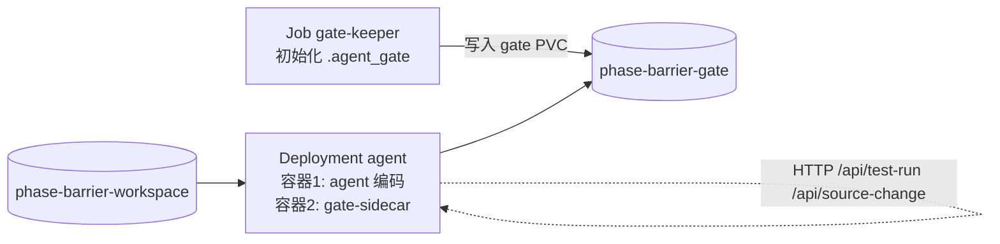

# Kubernetes 部署：agent + gate-sidecar（v0.7.0）

把阶段门禁从“进程内工具包装”升级到 **Pod 内进程级隔离**：门禁状态
（`.agent_gate`）存放在独立 PVC 上，只有 sidecar / gate-keeper 挂载，
编码 Agent 容器完全不挂载门禁目录，只能通过 sidecar 的 HTTP API
查询 / 推进阶段——即使 Agent 绕过工具包装直接操作文件系统，也无法篡改状态机。

## 拓扑



- `phase-barrier-workspace`：spec / 测试 / 实现代码，agent 与 sidecar 共享（sidecar 校验证据文件）。
- `phase-barrier-gate`：`.agent_gate`（state.json + audit.log），**只有** gate-keeper 与 sidecar 挂载。
- `gate-keeper` Job：对 gate PVC 可写，运行 `deploy/seed_gate.py` 完成一次完整门禁流程，
  生成可审计的初始交付态；后续真实 Agent 任务可复用同一状态机继续推进（或清空重来）。
- `gate-sidecar`：`python -m anti_shortcut.sidecar --workspace /workspace --port 8080`，
  提供 `GET /api/state`、`POST /api/advance`、`POST /api/test-run`、`POST /api/source-change`。
- agent 容器：只挂载 workspace；写代码后通过 localhost 调用 sidecar API 推进阶段。

## 快速开始（kind / minikube）

1. 构建并推送镜像（用仓库根 `deploy/Dockerfile`）：

   ```bash
   docker build -f deploy/Dockerfile -t <registry>/phase-barrier:0.7.0 .
   docker push <registry>/phase-barrier:0.7.0
   # kind 本地集群可直接 load：kind load docker-image <registry>/phase-barrier:0.7.0
   ```

2. 把 `gate-keeper.yaml` / `gate-sidecar.yaml` 中的镜像地址替换为你的镜像。

3. 启动集群并应用模板：

   ```bash
   kind create cluster            # 或 minikube start
   kubectl apply -f deploy/k8s/
   ```

4. 等待 gate-keeper 完成、agent Pod 就绪：

   ```bash
   kubectl get job phase-barrier-gate-keeper
   kubectl rollout status deploy/agent
   kubectl get pods
   ```

5. 验证 sidecar API 与门禁隔离：

   ```bash
   POD=$(kubectl get pod -l app=phase-barrier-agent -o jsonpath='{.items[0].metadata.name}')
   # 阶段查询（gate-keeper 已推进到交付态，期望 current_stage=6）
   kubectl exec "$POD" -c agent -- sh -c 'curl -s localhost:8080/api/state'
   # 门禁目录对 agent 不可见（不会挂载 gate PVC）
   kubectl exec "$POD" -c agent -- ls /workspace/.agent_gate   # 期望：No such file or directory
   # 跳跃阶段被拒绝（当前已是 6，advance 返回 409）
   kubectl exec "$POD" -c agent -- sh -c \
     'curl -s -X POST localhost:8080/api/advance -H "Content-Type: application/json" -d "{\"new_stage\": 5}"'
   ```

   > 若 agent 镜像没有 `curl`，可在同一 Pod 内用 `python -c` 调用，或在
   > `gate-sidecar` 容器内执行 `kubectl exec -it "$POD" -c gate-sidecar -- python -m anti_shortcut.sidecar --help`。

## 新任务流程（agent 接入协议）

1. Agent 启动后先 `GET /api/state` 确认初始阶段（新状态机为 1：Spec 设计）。
2. 在 `/workspace` 写 `spec.md` → `POST /api/advance {"new_stage": 2}`。
3. 写测试 → `POST /api/advance {"new_stage": 3}`；写实现 → `POST /api/advance {"new_stage": 4}`。
4. 自己运行测试命令后，把结果上报：`POST /api/test-run {"exit_code": 0, "output": "<命令输出>"}`
   （sidecar 会按语言适配器解析摘要 / 覆盖率，并写入状态机）。
5. `POST /api/advance {"new_stage": 5}`：一次通过则直接交付（阶段 6），否则进入阶段 5 修复回归。
6. 每次修改源码 / 测试后 `POST /api/source-change {"path": "..."}`，修复后重跑测试并重新上报。

需要覆盖率门禁时，把 `gate-sidecar.yaml` 中注释的 `--config /workspace/gate.yaml` 打开，
在配置里写 `coverage_threshold: 80`，测试命令带上覆盖率参数（如 `pytest --cov --cov-report=term-missing`）。

## 安全说明

- **门禁目录隔离**：agent 容器不挂载 `phase-barrier-gate`，文件系统层面无法接触状态文件；
  sidecar 是唯一可信写入方。
- **只读加固（可选）**：若把 gate PVC 的 `accessModes` 调整为 `ReadOnlyMany` 且 sidecar 以
  `readOnly: true` 挂载，则所有写入只能来自 gate-keeper 等初始化 Job——适合“先初始化、后只读校验”的
  门禁模式（此时 advance 只读校验证据，不修改状态，需要把推进操作也交给 gate-keeper Job 完成）。
- **网络**：sidecar Service 仅暴露在集群内；生产环境建议用 NetworkPolicy 限制只有 agent Pod 可访问。
- **镜像签名**：配合 sigstore / cosign 对 sidecar 镜像签名，防止供应链投毒（见仓库 Roadmap）。
- **状态签名（v0.8.0）**：为 sidecar 注入 `PHASE_BARRIER_HMAC_KEY`（Secret → env，见
  `gate-sidecar.yaml` 注释），state.json 即带 HMAC-SHA256 签名；Agent 篡改状态后
  sidecar 拒绝加载并明确报错。

- **审计远程推送（v0.9.0）**：sidecar 支持 `--audit-remote-url` / `--audit-remote-token`，
  也可用环境变量 `AUDIT_REMOTE_URL` / `AUDIT_REMOTE_TOKEN`（Secret 注入即可，无需改 args），
  审计事件异步批量转发到 SIEM / webhook，失败只计数、不影响门禁。
- **证据签名（v0.9.0）**：sidecar 推进阶段时写入 `evidence_manifest.json`；CI 可用
  `python -m anti_shortcut verify-evidence --workspace /workspace` 校验证据未被事后篡改。
- **密钥轮换（v0.9.0）**：`python -m anti_shortcut rotate-key --workspace /workspace --from <旧> --to <新> [--keep-old]`
  无中断轮换 HMAC 密钥（宽限期双密钥）。