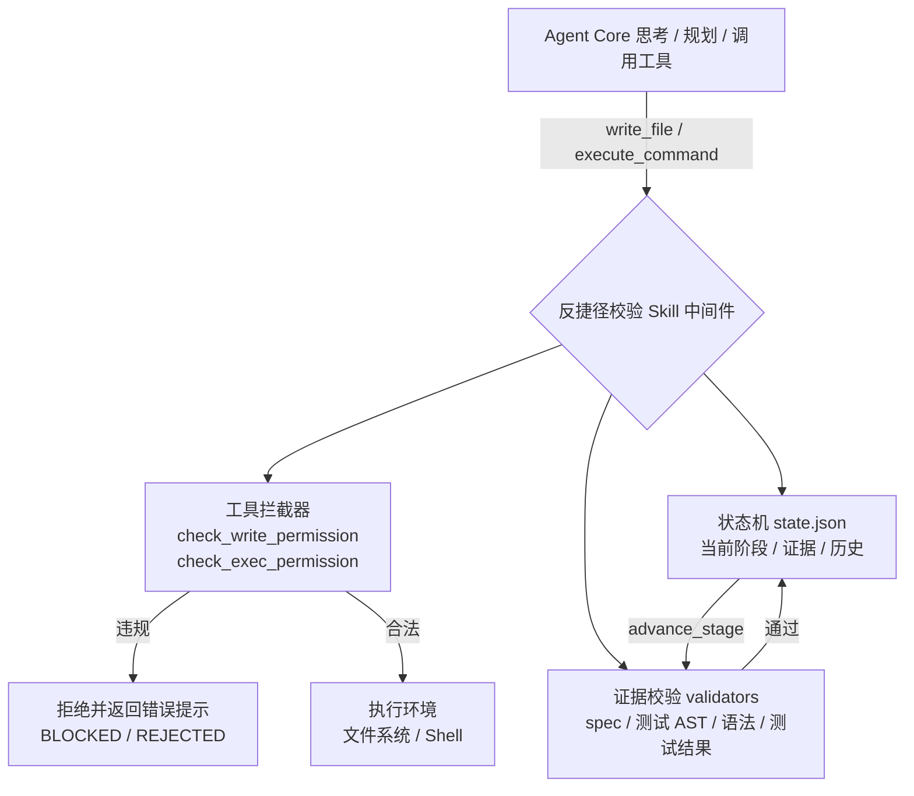

# 架构与设计

> 迁移自 README 精简版主页；[返回 README](https://github.com/Xuqing0415/phase-barrier#readme)

## 架构

```
Alpha-SWE Agent Core（思考 / 规划 / 调用工具）
        │  工具调用（write_file, execute_command, advance_stage）
        v
反捷径校验 Skill（中间件）
        ├── 状态机      ：阶段与证据持久化到 <workspace>/.agent_gate/state.json
        ├── 证据校验    ：每个阶段的校验函数（validators）
        └── 工具拦截    ：包装 write_file / execute_command，注入 advance_stage
        │  合法调用
        v
执行环境（文件系统 / Shell）
```

Mermaid 版本（GitHub 上渲染）：



- **多 Agent 并发共享门禁状态（v0.26.3）**：`StateManager` 跨进程文件锁（POSIX `flock` / Windows `msvcrt`）
  + 写前重载 + 唯一临时文件原子替换，多 Agent / 多进程并发推进不丢更新、状态文件不损坏；
  `PhaseBarrier.refresh()` 重载状态与证据清单，编排器轮询即可读取其他 Agent 的推进结果。

## 阶段定义与证据要求


| 阶段 | 名称 | 必需证据 | 校验方式 |
|------|------|----------|----------|
| 0 | 需求接收 | 用户需求原文（系统传入） | 自动记录 |
| 1 | Spec 设计 | `spec.md`，含 `## 需求分析` / `## 设计方案` / `## 接口定义`，且足够详细 | 文件存在 + 章节匹配 + 最小长度 |
| 2 | 测试用例 | `test_*.py` 等，测试函数数量 ≥ 阈值，每个函数含断言 | 文件存在 + AST 解析 |
| 3 | 实现代码 | 非测试 `*.py` 源码 | 文件存在 + 语法编译检查 |
| 4 | 运行测试 | 测试命令执行记录（退出码 + 输出摘要） | 拦截器记录 `last_test_run` |
| 5 | 修复与回归 | 修复后的代码 + 重新运行的测试全部通过 | 测试通过且发生在最后一次代码修改之后 |
| 6 | 交付 | （可选）交付总结 | 达到阶段 6 即完成 |

特殊分支：阶段 4 推进时，若最近一次测试**全部通过**且代码未被后续修改，则**跳过阶段 5 直接进入交付**；否则进入阶段 5 修复。

## 模块结构

```
anti_shortcut/
├── __init__.py        # 公共 API
├── config.py          # GateConfig（Pydantic）+ YAML 加载
├── state.py           # StateManager：JSON 原子持久化、阶段历史、证据
├── validators.py      # 各阶段证据校验器（spec / tests / implementation / test_run / retest）
├── interceptors.py    # 命令分类、门禁目录检测、shell 写路径提取、测试输出摘要
├── audit.py           # 结构化 JSON 审计日志（structlog，按文件独立实例）
├── remote_audit.py    # v0.9.0：审计事件异步批量推送到 SIEM / webhook（零依赖）
├── evidence.py        # v0.9.0：证据文件哈希 + HMAC 签名清单（verify-evidence）
├── skill.py           # AntiShortcutSkill：工具包装 + advance_stage + 权限检查
├── integration.py     # 集成层：bootstrap / 插件注册 / 入口点发现
├── paths.py           # 路径工具：glob 匹配 / 文件遍历 / SHA-256
├── languages/         # 语言适配层（v0.3.0）
│   ├── base.py        #   LanguageAdapter 抽象基类 + 共享校验策略
│   ├── python.py      #   PythonAdapter（AST + compile）
│   ├── javascript.py  #   JavaScriptAdapter（node --check / tsc --noEmit + jest --listTests）
│   ├── java.py        #   JavaAdapter（javac + JUnit 启发式）
│   ├── go.py          #   GoAdapter（gofmt + go test 解析）
│   ├── rust.py        #   RustAdapter（cargo check / rustc + cargo test 解析）
│   ├── ruby.py        #   RubyAdapter（ruby -c + RSpec / Minitest 解析，v0.11.0）
│   ├── csharp.py      #   CSharpAdapter（dotnet build + xUnit / NUnit / MSTest 解析，v0.11.0）
│   └── __init__.py    #   注册表 / detect_language / get_adapter / 入口点加载
├── __main__.py        # CLI：inspect / advance / write / exec / verify-evidence ...
├── sidecar.py         # K8s sidecar HTTP 门禁服务（v0.7.0）
├── proxy.py           # 透明代理引擎：write/exec 门禁（v0.17.0）
├── proxy_client.py    # Agent 侧 GateClient（v0.17.0）
examples/
├── demo.py                        # 模拟 Agent 完整演示（含违规拦截）
├── minimal_agent.py               # 最小可运行 Agent 接入示例
├── anti_shortcut_config.yaml      # Python 项目示例配置
├── anti_shortcut_js_config.yaml   # JavaScript / TypeScript 项目示例配置
├── anti_shortcut_go_config.yaml   # Go 项目示例配置
├── anti_shortcut_rust_config.yaml # Rust 项目示例配置
├── custom_adapter/                # 自定义语言适配器插件示例（虚构 .foo 语言）
├── github-action/                 # GitHub Action 门禁示例（gate.yml / gate-go.yml / gate-rust.yml / evidence-gate.yml）
├── mtls_audit/                    # v0.12.0：审计 mTLS 端到端示例（证书生成 + 收集端点 + demo）
└── plugin_rules/                # v0.13.0：自定义校验器 / 拦截规则插件示例（进程内注册 + 入口点加载）
deploy/
├── Dockerfile                     # 打包镜像（含 CLI）
├── docker-compose.yml             # gate-keeper（可写）+ agent（.agent_gate 只读）
├── seed_gate.py                   # gate-keeper：初始化并跑完整门禁流程
├── probe.py                       # agent 探针：验证只读挂载生效
├── k8s/                           # Kubernetes 部署模板（v0.7.0）
│   ├── pvc.yaml                   #   workspace / gate 两个 PVC
│   ├── gate-keeper.yaml           #   初始化门禁状态的 Job
│   ├── gate-sidecar.yaml          #   agent + sidecar Deployment + Service
│   └── README.md                  #   kind / minikube 验证步骤
└── README.md                      # 部署说明
tests/                             # pytest 测试套件（337 个用例）
```

## 设计取舍

- **阶段 4 -> 6 跳过修复**：测试一次通过时不必强制走修复阶段（见第 7 章工作流）。
- **修复后强制回归**：阶段 5 校验最近一次测试必须“通过”且“晚于最后一次代码修改”，防止改完不重测。
- **启发式 shell 解析**：`sed -i`、重定向等写路径提取是尽力而为；核心强制边界是工具包装 + 只读挂载，shell 解析用于纵深防御。
- **测试质量**：本 Skill 防“跳步”，不负责“测试写得好不好”；覆盖率与人工抽查可作为补充（见第 10 章）。

## 环境说明

- 实现语言：Python 3.10+（已在 3.14 验证）
- 依赖：`pydantic>=2`、`PyYAML>=6`、`structlog>=23`（可选 `pytest` 用于测试）
- 跨平台：Windows / Linux / macOS（门禁目录权限建议在 Linux 容器 + 只读卷场景使用）
